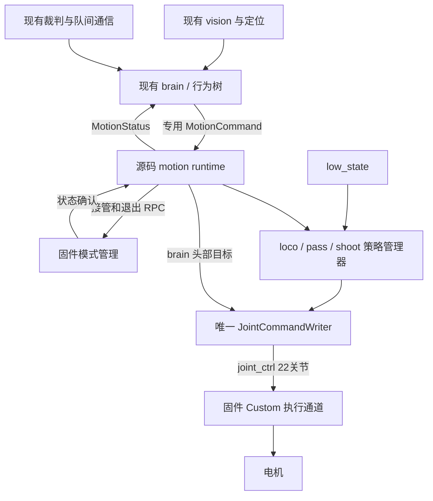

# RoboCup 源码运控迁移方案

依据 2026-09-27 当前工作区：`dancer_boosterdeploy` HEAD `8429fe3`，`dancer-robocupdemo` HEAD `da8d68d`。demo 的启动、brain 和视觉文件有未提交修改，本文以工作区内容为准。本次只做源码、平台配置和运行状态的只读调查，未切换机器人模式、未发送电机指令、未停止任何平台服务。

## 1. 推荐结论与目标边界

在 demo 中新增常驻的源码运控运行时，复用 deploy 已成功使用的 Python 策略和实机关节接口。brain 保留比赛决策，通过专用接口向运行时发送速度、踢球和头部目标；运行时内部切换 loco/pass/shoot，统一输出一条 22 关节的 `/joint_ctrl`。

比赛期间要求：机器人保持 `Custom`；固件内置行走、足球、踢球、起身及上肢动作不得作为比赛动作来源；源码运行时是唯一外部关节命令发布者。比赛暂停仍由源码零速度 loco 维持，不能因暂停、切换技能或重新定位而切回 Walking/Soccer。

**这里的目标是让内置运动策略不再作为送往电机的动作目标来源，保留固件的底层执行链路。Custom 不等于停止固件进程，也不能由配置图推断所有内置模型都停止计算。** 如果“固件关掉”要求 `booster-motion` 进程完全退出，现有 deploy 路线不满足；还需替换 Custom 接收、串并联转换、电机映射、状态发布等底层功能，属于另一项驱动层迁移，不能通过在启动脚本中增加 kill/systemctl stop 实现。

## 2. 已确认的现有链路

### demo 实机

```text
scripts/start.sh
  ├─ 平台相机 → vision
  ├─ game_controller → /robocup/game_controller
  └─ brain：100 Hz 行为树
       ├─ RobotClient → /LocoApiTopicReq → 固件内置运动控制
       └─ Brain::pubKickMsg → /kick_ball → 固件视觉踢球参考
```

- [start.sh](/home/booster/Workspace/dancer-robocupdemo/scripts/start.sh:34) 启动视觉、brain、裁判节点，没有启动源码实机运控。
- [RobotClient](/home/booster/Workspace/dancer-robocupdemo/src/brain/src/robot_client.cpp:30) 将 API ID 放入 `RpcReqMsg.header`，参数放入 JSON body；普通运动调用发布后直接返回 0，没有证明固件已经执行成功。
- [pubKickMsg](/home/booster/Workspace/dancer-robocupdemo/src/brain/src/brain.cpp:509) 产生机器人坐标系的球位置、踢球方向、power、目标和机器人朝向；可使用真实球、预测球、短期记忆和守门员拦截目标。
- `/kick_ball` 可以在未进入踢球技能时持续更新。是否踢球由 `RLVisionKick(true/false)` 控制，**收到 Kick 消息本身不是启动踢球的条件**。
- `RLVisionKick` 还管理进入/退出等待、超时、行为树中断和踢球时头部覆盖。源码后端必须保留这些会话语义。
- demo 确实已有 `src/sim_adapter/sim/src/motion.cpp`、loco/kick/getup 策略源码，但它们连接仿真感知、仿真关节输出和 ROS shim；不能视为已经具备源码实机运行时。
- 普通行为树 `Kick` 节点主要调用 `crabWalk/setVelocity` 向球移动，并非一律调用 `RobotClient::kickBall()`。迁移时不能把所有名字含 Kick 的节点都替换为 shoot。

### deploy 实机

```text
scripts/deploy.py → BoosterRobotPortal
  /low_state → 实测状态
  X：当前姿态保持命令 → ChangeMode(3) → GetStatus 确认 → 零速度 loco
  A：开放 loco 速度，或一次性切入所选 pass/shoot 任务
  policy 每 0.02 秒推理 → 22 关节 LowCmd(SERIAL) → /joint_ctrl
```

关键实现位于 [booster_robot_controller.py](/home/booster/Workspace/dancer_boosterdeploy/booster_deploy/controllers/booster_robot_controller.py:429)：`2000` 切模式，`2018` 查询 `current_mode`；接管前读取当前关节角并发一次保持命令。当前 X/A 流程适合独立调试，需要改造成比赛运行时生命周期。

当前 deploy 尚没有比赛所需的反复 `loco ↔ pass ↔ shoot` 调度。它还直接读取手柄速度，pass/shoot 自行跟球，默认退出回 Walking。这些不能原样带进比赛。

## 3. 固件如何选择电机命令

本机 [common_graph_define.lua](/opt/booster/Gait/configs/K1/common_graph_define.lua:704) 给出了以下连接：

```text
源码 /joint_ctrl
  → CustomBodyControlModule（debugging_mode）
  → parallel_mech_input_custom_mode（串联关节到并联执行机构转换）
  → planner_pvt_switch.in_9
  → intercept_motor_cmd
  → joint_map_input → 平台电机接口

内置行走 / 视觉踢球 / 起身
  → 各自的 planner_pvt_switch 输入

robot_state_manager.plan_body_control_index_
  → planner_pvt_switch.index，决定使用哪个输入
```

外部命令进入 Custom 的 DDS 接收细节在闭源模块中；上图后半段由本机配置连接直接支持。deploy 的 Custom 用法也与[官方低层 SDK 示例](https://github.com/BoosterRobotics/booster_robotics_sdk/blob/main/example/low_level/b1_low_sdk_example.cpp)一致。

需要区别三个编号空间：

| 编号 | 含义 | 接管时的用途 |
|---|---|---|
| `RobotMode::kCustom = 3` | SDK 运行模式 | `GetStatus.current_mode` 应为 3 |
| `BodyControl::kCustom = 6` | SDK 身体控制器 | 应核实 `current_body_control = 6` |
| 固件图 `in_9` | 内部 planner 的 Custom 输入 | 诊断映射，不直接等同 SDK 模式 |

brain 的 `currentRobotModeIndex` 实际来自 `fall_down_recovery_state.current_planner_index`，不是 SDK mode。不能直接把 `CheckAndStandUp` 中的 1、2、8、10、20 按 SDK mode 理解，更不能将 Custom=3 填进去代替原有判断。

还有一个独立的上肢覆盖路径：[intercept_motor_cmd 配置](/opt/booster/Gait/configs/K1/common_module_options.lua:2704) 包含索引 0–9，即头部和双臂。deploy 的头部控制已使用 `weight=1`；只有腿部模式正确并不足以证明全身没有其他动作覆盖。迁移需同时检查 action 状态和头/臂输出来源。

[Daemon 的 child.ini](/opt/booster/Daemon/bin/child.ini) 同时列出 RobotCore、Gait、RemoteController、ROS RPC 桥等组件。停止总 daemon 会影响多项服务，且 systemd 配置带自动重启。不能将“杀掉进程后暂时没动作”作为固件已可靠交权的实现或证据。

**排他性边界：**目前检查到的应用接口没有提供经过验证的独占租约。Custom 是控制器选择机制，不是禁止其他 SDK 客户端切模式的锁。必须消除所有已知外部运动入口，并持续检查状态；若要求对任意其他 DDS 客户端也能提供原子级排他保证，则需要固件侧独占/许可机制或经过验证的通信访问控制。单靠 publisher 数量和定期查询，不能证明任意瞬间绝无抢占。

## 4. 建议架构与接口



建议新增 `motion_interfaces` 和 `source_motion` ROS 2 包，保留 brain 的 C++ 实现，首版继续使用 deploy 的 Python/ONNX Runtime 推理代码，避免同时改语言和控制行为。

`motion.backend = source | firmware` 是启动时固定的二选一配置。默认比赛入口使用 source；只有完全退出 source 会话后才能显式回滚 firmware。禁止 source 失败后自动降级到固件行走。

source 后端建议每个 brain tick 末尾发布一份完整 `MotionCommand` 快照：

| 字段组 | 内容 |
|---|---|
| 会话与新鲜度 | brain 实例 ID、sequence、时间戳、有效期、技能会话 ID |
| 身体意图 | idle/loco/visual_kick/stop/fault，以及 `vx, vy, wz` |
| 踢球参考 | 原 `Kick` 的 x/y/dir/power/goal/朝向，加有效标志、参考更新时间/来源 |
| 头部 | yaw/pitch、有效标志、头部意图归属 |
| 比赛约束 | 当前允许的运动类别、暂停/终止状态 |

将 `RobotClient` 调用改为更新快照，在 `tree->tick()` 和 `pubKickMsg()` 完成后一起发布，避免 start 事件先到而本帧球参考尚未到达。每个 tick 刷新快照也能兼容仅在 `onStart()` 设置一次速度、随后保持的行为节点；不能简单对原始稀疏 API 事件加一个过短 TTL。

source 模式下 `pubKickMsg()` 填入专用快照，不向固件 `/kick_ball` 发送。调试所需可单独发布 `/dancer/kick_reference`。firmware 模式继续使用原协议。

`MotionStatus` 回报实际接管状态、当前技能/模型、最近接受的会话和序号、传感器年龄、推理延迟及错误。brain 据此决定运行/等待/停止；发布成功不能继续被解释为动作已执行。

运行时内部将推理和输出监督分离：推理工作进程只产生带时间戳与序号的关节目标，不拥有 ROS 电机发布器；唯一输出进程合并头部、校验数据并发布。ROS 实体在所属进程内创建，不直接继承原 Portal 中已经运行的 rclpy executor 再 fork 使用。

RPC 查询/等待必须与 50 Hz 输出循环分离并设置硬超时。状态、动作和命令都要有单调时钟的接收/产生时间；现有 deploy 的“曾收到 low_state”布尔标志不足以判断运行中的反馈新鲜度。故障阈值依据本机负载测量确定，不把推理进程还活着当作仍在及时输出。

## 5. brain 各入口如何迁移

| 当前入口 | source 后端行为 |
|---|---|
| `setVelocity / crabWalk / moveToPose...` | 写入物理单位速度；进入 loco 的本地命令处理 |
| `RLVisionKick(true)` | 开启本地技能会话；等待合格参考后选 pass/shoot |
| `RLVisionKick(false) / robocupWalk()` | 结束本地踢球会话，切回源码 loco，清除旧移动意图 |
| `changeRobocupMode() / walkMode()` | 请求本地 loco 就绪，禁止发送 Soccer/固件 gait 切换 |
| `moveHead()` | 写入 head mux，由唯一 writer 输出头关节 |
| `standUp()` | 转入源码恢复接口；首版未具备实机起身时明确返回 unsupported/fault |
| `enterDamping()` | 经 supervisor 撤销技能和输出许可，再执行受控退出 |
| `waveHand / kickBall / fancyKickBall` | 实现对应源码动作前禁用并回报不支持，禁止兜底调用固件 |

目前 `kickBall/fancyKickBall/walkMode/enterDamping` 的实现仍在类里，但本次搜索未发现其在现有 brain `.cpp` 中的调用；仍应封闭这些未来可能被复用的入口。WaveHand 有行为节点调用。

协议审计覆盖 `2000 ChangeMode`、`2001 Move`、`2004 RotateHead`、`2005 WaveHand`、`2008 GetUp`、`2038 VisualKick` 及内部踢球 `100011/100012`。source brain 不直接发布这些固件运动请求；接管/退出所需的 2000 只能由运行时监督层按状态机发出，2017/2018 查询可保留为只读。

还要处理 [game.xml](/home/booster/Workspace/dancer-robocupdemo/src/brain/behavior_trees/game.xml:26) 定位分支中的 `RobocupWalk`：文件顶部同名初始化虽已注释，该分支仍会切 Soccer。仅删一个初始化调用不够。

诊断部分独立发布 `2017 GetMode`，不在 RobotClient 内。它可以继续只读查询，但 source 模式更适合统一消费运行时状态，避免漏查第二个 RPC 发布入口。

## 6. 启动、运行和退出的控制权流程

### 启动顺序

1. 获取运行时单实例锁，确认旧 source 会话已退出。发现另一个 `/joint_ctrl` writer 时拒绝接管；同时审计固件 RPC、上肢动作、自动助理和其他遥控/SDK 控制入口。DDS 裸应用也必须计入，不能只看 ROS 节点名称。
2. 加载并预热所有模型、建立 low_state 订阅和 RPC 通道，校验 22 关节数量、数值、消息连续性、初始姿态和当前固件模式。初始姿态不满足时停在未接管状态，不能自动调用固件起身。
3. 启动现有 vision、裁判，以及处于输出禁止状态的 source brain；确认视觉、head_pose、odom 的实际数据可用。
4. 按 deploy 已有流程，以当前实测关节位置和 prepare 增益预装保持命令，然后请求 `ChangeMode(3)`。预装是有界的接管步骤，不能在未取得控制权时运行策略/扫描头部。
5. 用有超时的 RPC 确认 `current_mode=3`、`current_body_control=6`，并核实没有能覆盖输出的活动动作。处理旧 head/arm 动作须使用本版本已经核验的退出接口；无法确认时不放行。
6. writer 开始连续输出零速度源码 loco，显式接管两个头关节；再次验证 Custom 下的 low_state、head_pose、odom 和状态流，再公布 `motion_ready`。
7. brain 解除输出门禁。比赛入口可以自动完成原来的 X/A 流程；它只在机器人已经具备可接管姿态时放行，启动命令不隐含从任意倒地状态自动站起。

正常技能切换只发生在 source 内部，固件始终保持 Custom。READY、SET、PLAY、暂停、END 等阶段的具体行为仍来自原比赛逻辑；运行时用许可字段保证停止阶段无法保留旧踢球会话。不能把所有非 PLAY 状态统一屏蔽，因为 READY 等阶段仍需移动定位。

### 各类停止的不同处理

| 事件 | 处理 |
|---|---|
| 比赛暂停、SET、END | 取消踢球、速度清零，Custom 内继续源码零速度 loco；后续行为服从比赛状态 |
| brain 心跳失效 | 立即撤销踢球与移动；状态正常时进入有界源码零速度维持，超过故障处理期限后受控退出 |
| low_state 超时、推理超时/NaN、跌倒 | 停止接受策略目标，进入故障处理；不得继续重发无限期旧目标 |
| 发现模式不再为 Custom 或存在意外动作 | 撤销输出许可、锁存故障；禁止与其他控制者反复争抢模式 |
| 正常结束整个比赛进程 | 撤销 brain 许可与技能，执行有界减速；确认 writer 不再发送运动目标，执行 Damping 交接并确认，再退出进程 |
| Ctrl+C / SIGTERM / worker 崩溃 | 同一 supervisor 路径处理，不回 Walking/Soccer |

Damping 是退出/急停后的底层保护状态，会撤掉主动支撑，不能当作“站好等待下一场”。source 独占的比赛会话在该交接时结束。正常暂停应留在 Custom 的源码维持状态。

有序退出需要停止/确认输出任务、清理待发队列，并核验本机上肢 `weight` 在退出后的行为。仅先发 Damping、随后等待旧 worker 退出，存在尾部目标继续发送的窗口。

增加独立存活监督：主运行时异常消失时执行既定的 Damping 处置，不发布第二路 joint_ctrl。主机断电、DDS 中断等情况还必须验证固件 Custom 的命令超时保护；目前源码和配置未证明该超时行为，不能假设最后一帧会自动失效。若平台没有可用保护，需要底层补齐后才能完成故障验收。

## 7. 策略迁移的数值与语义

### 保留已成功的 deploy 基线

本次 SHA-256 比对确认：deploy 的 3 个 loco、1 个 pass、5 个 shoot ONNX 文件与 demo `models/` 内对应文件完全一致。模型资源可以复用，主要工作在运行时和接口。

| 项目 | 应保留的基线 |
|---|---|
| 周期 | 50 Hz / 0.02 s，不能随 brain 100 Hz 重复推理 |
| loco | 69 维单帧 × 10 历史 = 690 输入，20 输出，base/side/turn 自动路由 |
| pass/shoot | 71 维单帧 × 10 历史 = 710 输入，20 输出 |
| 关节输出 | 20 身体关节映射 + 2 头关节 = 22，SERIAL；不套用 SDK 示例的 T1 23 关节数组 |
| 动作处理 | 当前 default pose、映射、clip、scale=0.25、filter=0.8、历史顺序和 previous action 语义 |
| 电机增益 | 各技能最终应用实机覆盖后的 kp/kd；切换时同步更新，准备阶段也必须使用对应有效配置 |

当前 loco 实现已经没有旧文档提到的 `vyaw=0.2` 准备命令、速度渐增或 gravity offset 加法。虽然 JSON 仍含 `gravity_offset`，当前 Python 路径未使用它。首版以实际 deploy 代码为基线，不因读取旧排查文档或复制 sim C++ 实现而重新引入这些差异。

### 速度

brain 已给出 m/s 和 rad/s；deploy 原 `update_vel_command()` 把输入视为 [-1,1] 手柄值再缩放。source 后端需要直接接收物理单位、按当前 loco 配置限幅，不能重复缩放。比赛模式关闭 deploy 的键盘/手柄速度写入，保留受控急停路径。

brain 自身仍有小速度最小值补偿和上限，首版保留并在联调记录输入/输出；后续如需重新整定，将其作为独立行为变化验证。

### 踢球参考、模型和会话

- deploy 当前使用 `atan2(ball_y, ball_x)` 作为试验方向。比赛必须使用 brain 的 `Kick.dir`，它已在机器人坐标系，不能再减一次机器人朝向；球 x/y 同样使用 brain 提供的机器人坐标。
- pass 首版保留已验证的 power-2 模型。brain 常规传球为 2，定位球/守门员默认 2.5 经参考实现限幅也为 2；若要支持 0.5–1.5 等弱传球，需要补齐 pass 的 0/1 模型及路由，不能把任意 power 当作已验证能力。
- `power>5` 选择 shoot，其观测中的方向向量幅度仍是 1，不能填 6；其余正常比赛 power 选择 pass。power=5 在当前仿真 helper 回落 pass，应明确记录此边界行为。
- 五个 shoot 模型的自动路由参考 [kick_policy.cpp](/home/booster/Workspace/dancer-robocupdemo/src/sim_adapter/sim/src/policy/kick_policy.cpp:180)：`e=wrap(dir-atan2(ball_y,ball_x))`；e>1.2 选 0109_0，>0.3 选 2，>-0.4 选 264，>-1.2 选 192，其余 0109_2。已有 route 且球距<1 m 时保持路线。每条路线使用自身球位置/yaw offset。
- 固定模型运行成功不等于这些自动切换已在实机验证。先接通固定 pass/shoot，再单独验收自动 route。
- family 在一次 VisualKick 会话起始锁定；同一 family 内路由复用观察历史、previous action、过滤器与交替标志。会话结束、再次进入及跨 family 的 reset 必须明确，不能每个指令帧都 reset 或重新加载网络。
- 保留最近有效的原始球参考以处理短时漏检，offset 只在构建当前观测时施加一次。缓存不代表无限技能授权：取消、暂停、brain 心跳超时、会话期限优先终止技能。新会话启动要求新鲜的合格参考，旧缓存不能单独触发新踢球。
- `ball_valid=false` 与“新鲜度字段停止更新”要区分；brain 的参考可能是预测/拦截目标，不能偷偷退回 deploy 的原始检测球覆盖它。

### 切换连续性与头部

全部技能模型在接管前加载；只保留一个运行时和一个 writer。loco → kick 首帧沿用当前实测姿态作为过滤起点；kick → loco 按测量状态和最后输出初始化连续交接，不能回用数秒前的 loco 历史。切换规则经离线轨迹回放与实机分阶段验证后固定。

首版让 brain 拥有所有头部意图，包含找球、扫场定位、踢球低头；关闭 deploy 的自动 HeadBallTracker。writer 统一限位/限速并合入索引 0、1，保持已验证的 `weight=1` 处理；上肢其他索引不盲目全设 1，要验证原 Custom 路径和 action 清理结果。

现有 `RLVisionKick` 与 CamFindAndTrackBall 会同时产生头部请求，且踢球覆盖并非每 tick 都重新发送。聚合快照要保留“踢球会话覆盖”的持续优先级，不能简单采用最后调用覆盖并让下一帧 CamTrackBall 抢回头部。丢失 brain 后按监督状态处理，不能再并行启用第二套自动扫描。

## 8. 里程计、头部位姿和起身缺口

brain/vision 继续依赖实测 `/low_state`、`/head_pose`、`/odometer_state`。保留固件底层后，应首先验证它们在 Custom 下持续更新且语义正确。特别是固件 odom estimator 明确接收 planner index，不能根据 Prepare 下有消息便推断 Custom 下也正确。

如果 Custom 下 odom 不工作，可以在独立、明确的话题上接入 demo 的 K1 里程计模型实现再 remap brain；现有 `scripts/k1_odom_estimator.py` 是估计计算工具，不是已完成的 ROS 实机发布节点。避免在原话题叠加第二个不受控发布源。`head_pose` 必须由实测关节和正确运动学计算，不能用目标头角伪造。

**全源码比赛还缺经过实机验证的起身。** 当前 deploy 的 loco/pass/shoot 不能替代 `CheckAndStandUp → 固件 GetUp`。demo 虽有仿真 getup 源码与恢复资源，但迁到实机仍需关节映射、轨迹/模型、增益、姿态识别和失败退出验证。

第一阶段应明确“跌倒即退出、等待恢复”，关闭自动固件 GetUp；完成源码 getup 后再声称具备完整的源码自主比赛恢复能力。允许固件起身后再交还 Custom 是另一种混合方案，不满足比赛期间只有源码产生动作的要求，不作为本方案默认行为。

## 9. 文件级实施清单

| 位置 | 变更 |
|---|---|
| 新增 `src/motion_interfaces/` | MotionCommand、MotionStatus、生命周期控制接口 |
| 新增 `src/source_motion/` | policy manager、robot I/O、唯一 writer、ownership supervisor、配置/launch |
| deploy 的 policy/配置/推理依赖 | 迁入可安装 Python 库并保留许可与来源；不依赖绝对路径访问旁边 deploy checkout |
| demo `models/` | 复用已核对模型，安装时打包 manifest/哈希，显式模型根目录 |
| `src/brain/src/robot_client.cpp` 与头文件 | source/firmware 后端选择，所有动作入口统一走所选后端 |
| `src/brain/src/brain.cpp`、相关状态结构 | 合并 Kick 参考、tick 末尾快照、接管状态门禁与故障处理 |
| `src/brain/src/brain_tree.cpp` | RobocupWalk、本地 VisualKick 取消/确认、头部优先级、起身能力处理 |
| brain config/launch | 启动时固定 backend，传递 source 状态和模型/时限配置 |
| `scripts/start.sh` | 顺序启动、ready 条件、单实例、失败回收；保留本地相机和时钟修复 |
| `scripts/stop.sh` | 先撤销技能与交接，再停进程；替换原有 killall -9 主路径 |
| build/distribution | 安装 Python 包、模型、消息、依赖和监督组件，防止只在源码目录能运行 |
| assist/start_test/start_brain 等旁路 | 纳入同一 backend/互斥规则，禁止比赛同时启动旧固件控制入口 |

## 10. 分阶段交付与验收

| 阶段 | 交付与通过条件 |
|---|---|
| A：离线迁移 | 模型/配置固定；相同状态与参考产生与 deploy 基线一致的 obs、action、关节命令；路由、reset、取消、暂停、过期、模式错误有测试 |
| B：shadow 运行 | 接真实 brain/传感器但无 joint_ctrl 发布、无模式修改；记录拟选技能、延迟、头部和踢球方向；核对 source brain 没有发出固件运动请求 |
| C：Custom 接管与 loco | 在受控支撑条件下验证接管/退出、状态闭环、头部/双臂来源和零速/低速 loco；异常 RPC 超时不能放行 |
| D：pass/shoot 闭环 | 固定模型→战术 dir/power→五路 shoot；验证技能多次切换和脑端中断；不因收到 /kick_ball 就开始踢球 |
| E：比赛生命周期 | READY/SET/PLAY/暂停/END、重新定位、brain 重启、重复启动、worker 崩溃、模式被外部改变、low_state 中断、SIGTERM 和监督故障注入 |
| F：源码恢复 | 迁移并验证 getup；通过后才能验收包含跌倒恢复的完整源码自主比赛 |

需要同时保留的验收证据：

1. 全场 source 会话内 SDK mode=Custom、body control=Custom，没有意外动作；内部 planner 映射与本版本一致。
2. 只有一个外部 joint_ctrl writer；除受控接管/退出外，brain 不向固件发送 Move、RotateHead、Soccer、VisualKick、GetUp 或上肢动作请求，固件 kick 参考不再收到比赛数据。
3. 实测头、臂、腿都跟随运行时输出；DDS graph 只能辅助排查，不能单独证明固件内部仲裁结果。
4. 50 Hz 控制在 vision/brain 同时运行时满足期限，超时不积压补发；记录 command/state/action 年龄和 inference 延迟。
5. 故障时取消旧会话、不自动恢复固件行走、不因 supervisor 重启立即执行旧指令；重新接管需全新会话和完整状态确认。

## 11. 本次只读实机核查与未验证项

- 6 秒采样收到 low_state 1676 条、head_pose 340 条、odometer_state 1659 条、recovery_state 3 条；low_state 为 22 个 serial motor。此计数包含发现与回调开销，不当作精确传感器频率指标。
- 采样时 `/joint_ctrl` 无发布者、有 2 个裸 DDS 订阅者；`/kick_ball` 有 2 个裸 DDS 订阅者；固件 Loco 请求话题上存在多个裸 DDS 发布端。它们的具体进程/权限归属需在迁移接管审计中识别。
- 通过现有 `/booster_rpc_service` 调用只读 `2018` 成功，返回 `status=0`、`current_mode=1`、`current_body_control=2`、`current_actions=[]`，即采样时为 Prepare。直接 topic 的一次 2018 查询未在采样窗口得到匹配响应，首版应沿用 deploy 已验证的服务通道并设置调用超时。
- 本次没有进入 Custom，因而没有实测 Custom 排他性、Custom 下里程计有效性、命令丢失保护或电机交接。上述项目是方案的实施验收条件，不能视作本次已完成验证。
- `/opt/booster/version.txt` 含两条历史版本记录（最新记录 v1.6.1.1），而 deploy README 的最低版本陈述不一致。应以本机能力探测、实际加载的配置和模块版本确定兼容性，不能根据 README 单一版本号承诺支持。

最终推荐交付是：**保留 demo 比赛入口，新增一个常驻源码运动运行时；利用 Custom 选择源码目标，封闭所有内置比赛动作入口；先完成 loco/pass/shoot 和受控退出，再补齐源码起身。**
