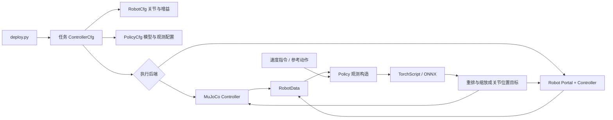
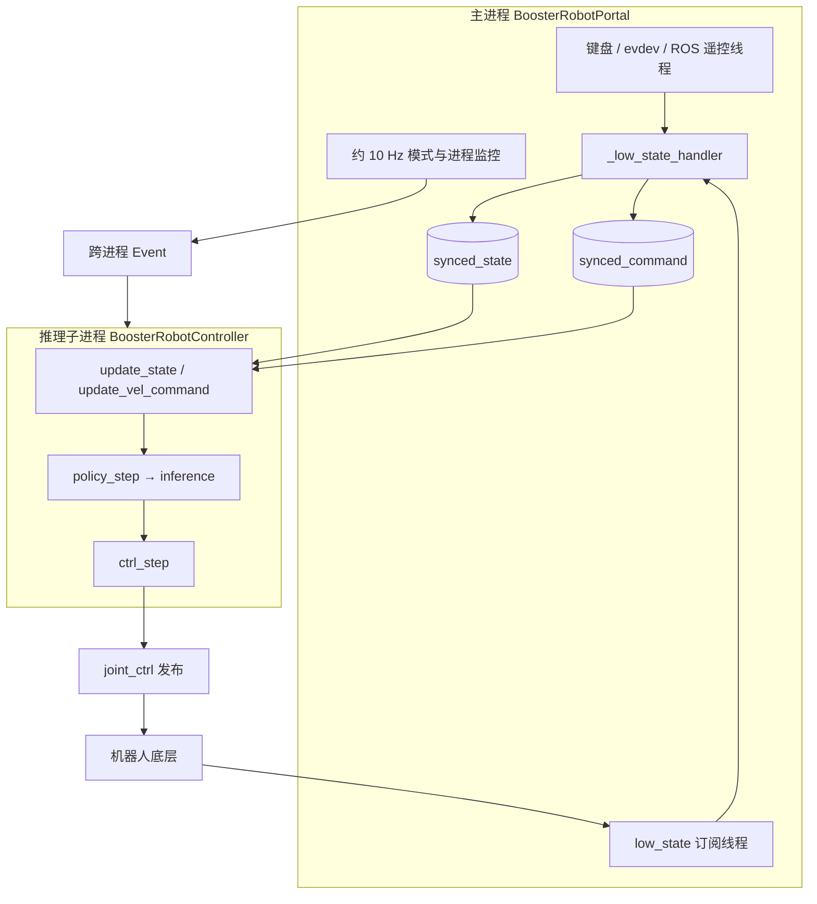

# Booster Deploy 代码解读与运控数据流

本文依据当前工作区源码与本地 NPZ 文件整理（2026-09-21）。目标是让你沿着真实调用链掌握部署过程，尤其是状态、观测、动作和电机命令之间的转换。本文中的维度来自代码及配置推导；未运行 ROS 2 实机、MuJoCo 或模型推理，不能视为运行验证。固件内部控制实现不在本仓库中。

## 1. 最快阅读路线

建议先读第 3.1 节，逐块看完入口；再按第 4.6 → 7.4 → 7.5 → 8.4 → 9.1 节对照核心代码，沿一次推理把数据追到底。注册、配置类和常规初始化只需知道输入输出，主要精力放在观测构建和动作转换。第 12 节用于实际定位问题。

本文用“源码片段 → 各行含义 → 张量形状/数值例子 → 下一步去向”讲解关键代码。片段来自当前源码，个别片段省略日志、注释或无关分支，并明确标注；带“等价表示”的代码仅用于解释。维度表中的切片均采用 Python 的左闭右开规则。

| 顺序 | 对照源码 | 重点看什么 |
|---|---|---|
| 1 | [scripts/deploy.py](../scripts/deploy.py) | `main()`：发现任务、取配置、选择实机或仿真 |
| 2 | [controller_cfg.py](../booster_deploy/controllers/controller_cfg.py) | `ControllerCfg` 如何组合 robot、policy、vel_command、mujoco、booster |
| 3 | [base_controller.py](../booster_deploy/controllers/base_controller.py) | `RobotData`、`BaseController`；统一的数据和策略接口 |
| 4 | [booster_robot_controller.py](../booster_deploy/controllers/booster_robot_controller.py) | 先看 `BoosterRobotController.run()`，再反查 Portal 的状态回调与启动流程 |
| 5 | [locomotion.py](../tasks/locomotion/locomotion.py) | `compute_observation → inference → _action_to_targets` |
| 6 | [beyond_mimic.py](../tasks/beyond_mimic/beyond_mimic.py) | 参考动作、姿态误差、关节映射、动作缩放 |
| 7 | [mujoco_controller.py](../booster_deploy/controllers/mujoco_controller.py) | 与实机共享策略，但在 Python 中计算 PD 力矩 |
| 8 | [synced_array.py](../booster_deploy/utils/synced_array.py)、[remote_control_service.py](../booster_deploy/utils/remote_control_service.py) | 跨进程数据与遥控输入 |

文中函数名可直接用编辑器符号搜索定位；附录提供当前版本的源码行号索引。

## 2. 系统负责什么

这是训练完成后的策略部署框架。主要工作是读取机器人状态，把状态组织成训练时约定的观测张量，运行模型，再把输出转换为关节位置目标。仓库没有训练循环，也没有独立的轨迹优化、逆运动学或全身控制求解器。

两类任务共用控制器接口：

- **Locomotion**：输入速度指令与机器人状态，输出行走关节目标。
- **BeyondMimic**：输入参考动作帧与机器人状态，输出动作跟踪关节目标。NPZ 参考角度是模型输入的一部分，并非直接逐帧下发到电机。



`BaseController` 构造时创建 `BoosterRobot`、可选的 `VelocityCommand`，然后通过 `cfg.policy.constructor(cfg.policy, self)` 创建策略。`start()` 设运行标志并调用 `policy.reset()`，**没有返回观测**；类顶部的接口说明并不完全等同于实现。`policy_step()` 只推进计数并调用 `policy.inference()`。

`_elapsed_s = _step_count × policy_dt` 是逻辑时间，不是实际墙钟时间。

## 3. 入口、注册和配置如何生效

`deploy.py` 使用 `pkgutil.walk_packages` 递归导入 `tasks` 下的模块。机器人任务目录的 `__init__.py` 在导入时执行 `register_task(name, cfg实例)`。随后 `get_task()` 取出该实例，入口覆盖 `policy.device` 和可选的 `booster.exit_mode`。

| 任务名 | 配置所在目录 | 策略 | 机器人关节数 N / 模型动作数 |
|---|---|---|---|
| `k1_walk` | [locomotion/robots/k1](../tasks/locomotion/robots/k1/__init__.py) | K1 Locomotion | 22 / 20 |
| `t1_walk` | [locomotion/robots/t1](../tasks/locomotion/robots/t1/__init__.py) | T1 Locomotion | 23 / 21 |
| `t2_walk` | [locomotion/robots/t2](../tasks/locomotion/robots/t2/__init__.py) | T2 Locomotion | 31 / 23 |
| `k1_mj2`、`k1_fight` | [beyond_mimic/robots/k1](../tasks/beyond_mimic/robots/k1/__init__.py) | BeyondMimic | 22 / 22 |
| `t1_motion_tracking` | [beyond_mimic/robots/t1](../tasks/beyond_mimic/robots/t1/__init__.py) | BeyondMimic | 23 / 23 |
| `t2_dance` | [beyond_mimic/robots/t2](../tasks/beyond_mimic/robots/t2/__init__.py) | BeyondMimic | 31 / 31 |

`@configclass` 位于 [configclass.py](../booster_deploy/utils/isaaclab/configclass.py)，为配置提供 dataclass 风格能力及复制、替换等工具。读参数时需要沿继承关系和 `__post_init__()` 找到最终值：机器人基础配置 → 任务基类 `.replace(...)` → 具体任务 `__post_init__()` → CLI 覆盖。

三个概念不要混用：

| 配置 | 实际含义 |
|---|---|
| `robot.default_joint_pos` | 模型输出转换成关节目标时的基准姿态，也用于行走观测中的位置差 |
| `robot.prepare_state` | 切入 Custom 时的位置保持增益，以及 standing 准备时的插值终点 |
| `robot.joint_stiffness / joint_damping` | 策略运行时下发的 Kp/Kd；可被任务覆盖 |

模型相对路径以**策略类定义文件所在目录**为基准。例如 `t2_walk` 的 `robots/t2/models/t2_walk.pt` 最终位于 `tasks/locomotion/robots/t2/models/`。当前 `t2_dance` 配置选择 `.onnx`，即使旁边也有 `.pt`，也不会自动改用它。

### 3.1 `deploy.py` 全部代码块逐段解读

入口文件不构造观测，也不计算电机命令。它完成“解释启动参数 → 取任务配置 → 启动具体控制器”。下面按文件顺序覆盖所有执行代码，仅省略原有说明性注释。

**块 1：加载命令行工具，补充模块搜索路径。**

```python
import argparse
import sys

sys.path.append(".")
```

`argparse` 解析启动参数；`sys` 用于修改模块搜索路径和退出程序。`"."` 指启动时的当前目录，因此示例要求从仓库根目录执行脚本，才能找到同级的 `tasks`、`booster_deploy` 包；它不是根据脚本位置自动计算根目录。

**块 2：要求选择一个任务，或列出任务。**

```python
parser = argparse.ArgumentParser()
group = parser.add_mutually_exclusive_group(required=True)
group.add_argument("--task", type=str, help="Name of the configuration file.")
group.add_argument("-l", "--list", action="store_true", dest="list_tasks",
                   default=False, help="list available tasks")
```

互斥组要求 `--task` 与 `--list` 二选一。`--task t2_walk` 得到 `args.task == "t2_walk"`，这是注册名，并非配置文件路径，虽然 help 写的是 configuration file。`--list`/`-l` 不接收值，出现时把 `args.list_tasks` 设为 True；不出现为 False。两者都不给或一起给会由 argparse 报错。

**块 3：执行后端、设备与退出模式。**

```python
parser.add_argument("--mujoco", action="store_true", default=False,
                    help="deploy in mujoco simulation")
parser.add_argument(
    "--device", type=str, default="cpu",
    help="Device to run the evaluation on (e.g., 'cpu', 'cuda')")
parser.add_argument(
    "--exit-mode",
    choices=("walking", "damping"),
    default=None,
    help="Robot mode to enter after controller exit (default: task config, walking)",
)
args = parser.parse_args()
```

`--mujoco` 决定后端，未指定时走实机分支。`--device` 是字符串，传给策略配置；是否支持及实际在哪里计算还取决于后端，ONNX 当前固定 CPU。`--exit-mode` 只接受两种值，缺省 None 表示保留任务自身退出配置。`parse_args()` 此时执行，生成模块级 `args`；因此单纯 import 此脚本也会触发参数解析。

**块 4：导入任务包，让注册语句执行。**

```python
def main():
    import pkgutil
    import tasks as tasks_pkg

    for mod_info in pkgutil.walk_packages(tasks_pkg.__path__, prefix="tasks."):
        full_name = mod_info.name
        try:
            __import__(full_name)
        except Exception as e:
            raise e
    from booster_deploy.utils.registry import get_task, list_tasks
```

递归扫描得到 `tasks.locomotion.robots.t2` 等模块名；import 触发模块末尾的 `register_task("t2_walk", T2WalkTaskCfg())`。注册本质上是向字典保存配置实例。这里不是加载全部神经网络模型，模型在后续创建 Policy 时才加载。`except ... raise e` 没有容错跳过模块，任一模块导入失败都会中断启动，`--list` 也一样。

**块 5：打印任务后正常退出。**

```python
    if args.list_tasks:
        print("Available tasks:")
        for task_name, cfg in list_tasks().items():
            cls = type(cfg)
            full_cls = f"{cls.__module__}.{cls.__qualname__}"
            print(f"  {task_name}\t:\t{full_cls}")
        sys.exit(0)
```

`list_tasks()` 返回注册字典的浅拷贝；循环打印注册名和配置类的完整 Python 名称。`__module__` 是类所属模块，`__qualname__` 是类限定名。退出码 0 表示正常结束，不会继续创建控制器。

**块 6：查找任务，应用命令行覆盖。**

```python
    try:
        task_cfg = get_task(args.task)
    except KeyError:
        print(f"Unknown task '{args.task}'. Available tasks: {list(list_tasks().keys())}")
        sys.exit(1)

    task_cfg.policy.device = args.device
    if args.exit_mode is not None:
        task_cfg.booster.exit_mode = args.exit_mode
```

查不到注册名就提示可选任务，以错误码 1 退出；查到就直接取注册的配置实例。设备总会被覆盖，包括默认的 cpu；退出模式仅在明确传参时覆盖。此处只是改配置，还没有运行策略。

**块 7：创建后端并进入它的运行循环。**

```python
    if args.mujoco:
        from booster_deploy.controllers.mujoco_controller import MujocoController

        MujocoController(task_cfg).run()
    else:
        from booster_deploy.controllers.booster_robot_controller import BoosterRobotPortal
        with BoosterRobotPortal(task_cfg) as portal:
            portal.run()
```

分支内部才导入后端，使选仿真时不必在此加载实机控制模块。MuJoCo 构造器创建策略和模型环境，`run()` 进入仿真循环。实机先创建 Portal，负责通信、准备模式和子进程；`portal.run()` 再启动实际控制流程。`with` 正常或异常退出时调用 `__exit__()` 清理资源，具体控制逻辑见第 4～5 节。

**块 8：脚本执行入口。**

```python
if __name__ == "__main__":
    main()
```

直接运行脚本时调用 `main()`，被其他模块 import 时不调用它。注意，这个保护只覆盖 `main()` 调用，不覆盖上面的模块级 `parse_args()`。

## 4. 实机运控的数据传递全链路

### 4.1 谁在哪个进程工作



**实际代码由推理子进程直接调用 ROS publisher 下发。** `synced_action` 虽被分配，`low_cmd_process` 虽有成员和清理分支，但当前没有动作写入、读取和独立发布进程的运行链路。不要根据这些名字画出并不存在的动作共享内存转发层。

### 4.2 状态进入 Python

`_start_low_state_subscription()` 创建线程及 `SingleThreadedExecutor`，订阅绝对话题 `/low_state`，QoS 为 `BEST_EFFORT + KEEP_LAST + depth=1`。

`_low_state_handler()` 每次回调：

1. 记录状态回调时间戳。
2. 从 IMU 取 `rpy` 和 `gyro`。
3. 按 `motor_state_serial` 的数组顺序取 `q / dq / tau_est`，没有按名称重排。
4. 把结果写入 `synced_state`，设置首次有效状态事件。
5. 读取遥控服务当前三轴值，另行写入 `synced_command`。

| 共享状态字段 | shape | 来源 | 后续转换 |
|---|---|---|---|
| `root_rpy_w` | `(3,)` | `imu_state.rpy` | 转 `root_quat_w` |
| `root_ang_vel_b` | `(3,)` | `imu_state.gyro` | 直接作为角速度 |
| `root_pos_w` | `(3,)` | **代码填零** | 没有实机定位估计 |
| `root_lin_vel_w` | `(3,)` | **代码填零** | 逆旋转后仍为零 |
| `joint_pos` | `(N,)` | `motor.q` | 实机关节顺序 |
| `joint_vel` | `(N,)` | `motor.dq` | 实机关节顺序 |
| `feedback_torque` | `(N,)` | `motor.tau_est` | 当前两类策略没有放进观测 |

结构化数组使用 NumPy `float`，实际为 float64；转换为 `RobotData` 时变为 Torch float32。惯例上关节角是 rad、角速度 rad/s，速度指令是 m/s、rad/s；本仓库没有进行单位换算，协议单位必须与配置及训练约定一致。

### 4.3 共享内存到底保证了什么

`SyncedArray` 基于 `multiprocessing.shared_memory`，按名称和主进程 PID 命名。`write()` 拷贝整个数组；`read()` 返回副本，并非长期共享视图。实现使用 `fcntl.flock` 做读写锁。

它传递的是“最近一次状态”，没有队列、帧号、采样时间或消费确认。推理可能重复读到同一状态，也可能跳过多帧。`synced_state` 和 `synced_command` 是两次独立写入/读取，不能把它们当作同一时刻的原子快照。

还需注意：当前子进程接收整个 Portal，没有调用 `SyncedArray.attach()` 重新打开锁文件。若采用 fork，锁文件描述符也会继承；不能仅凭 `flock` 调用就认定跨父子进程互斥已得到验证。这是后续并发验证点，不是本文实测结论。

### 4.4 子进程内的一个控制周期

`BoosterRobotController.run()` 开始时先更新状态和速度指令，再 `start()`，保证策略 `reset()` 能读到当前姿态。之后按 `policy_dt` 执行：

```text
读取共享状态
  → update_state(): NumPy → Torch float32 → 策略 device
  → RPY 转 wxyz 四元数
  → 世界系线速度逆旋转到机体系（当前实机输入为零）
读取共享命令
  → update_vel_command(): 解锁检查、按任务上限缩放
  → policy_step(): 更新逻辑计数 → policy.inference()
  → dof_targets: [N]，实机关节顺序，关节位置目标
  → ctrl_step(): 填 MotorCmd.q/kp/kd → publish(LowCmd)
```

`RobotData` 的后缀 `_w` 指世界系，`_b` 指机体系；四元数在本项目数学工具中使用 `wxyz`。世界系向量变成机体系向量的调用是 `quat_apply_inverse(root_quat_w, vector_w)`。

### 4.5 下发包及 PD 的边界

发布的话题字符串是相对名称 `joint_ctrl`，默认命名空间下解析为 `/joint_ctrl`；QoS 为 `RELIABLE + KEEP_LAST + depth=1`。消息为 `LowCmd`，`cmd_type = CMD_TYPE_SERIAL`。

| MotorCmd 字段 | 策略运行时的值 |
|---|---|
| `q` | `dof_targets[i]` |
| `kp` | 当前 Controller 的 `robot.joint_stiffness[i]` |
| `kd` | 当前 Controller 的 `robot.joint_damping[i]` |
| `dq` | 初始化为 0，策略循环未改 |
| `tau` | 初始化为 0，策略循环未改 |
| `weight` | 初始化为 0，当前代码未改；具体语义由外部接口决定 |

所以网络输出不是力矩。Python 实机路径负责发送位置目标和增益；底层如何处理串联关节、并联执行机构、力矩饱和等，需查看固件。本仓库的 `effort_limit` **没有在实机 `ctrl_step()` 中做力矩裁剪**，它在仿真限幅和部分策略动作缩放中使用。

### 4.6 从 `deploy.py` 出发：实机程序到底一步步调用了什么

这一节先回答“程序怎么走到这里”，再解释“这里在干什么”。你可以同时打开 `scripts/deploy.py` 和 `booster_deploy/controllers/booster_robot_controller.py`，按下面的步骤跳转。示例采用默认的 `prepare_mode="walking"`。

#### 4.6.1 起点：`deploy.py` 第 67～69 行

假设你运行：

```bash
python scripts/deploy.py --task t2_walk
```

没有加 `--mujoco`，所以 `main()` 走到 [deploy.py 的实机分支](../scripts/deploy.py#L67)：

```python
from booster_deploy.controllers.booster_robot_controller import BoosterRobotPortal
with BoosterRobotPortal(task_cfg) as portal:
    portal.run()
```

把这三行翻译成普通话：

| 代码 | 在做什么 | 接下来跳到哪里 |
|---|---|---|
| `from ... import BoosterRobotPortal` | 从 `booster_robot_controller.py` 取出 `BoosterRobotPortal` 这个类 | 只是导入；还没有运行它的 `run()` |
| `BoosterRobotPortal(task_cfg)` | 按选好的任务配置，创建一个实机管理对象 | 自动调用该类的 `__init__()`，第 51 行 |
| `with ... as portal` | 进入这个对象的使用范围，并把它命名为 `portal` | 调用 `__enter__()`，第 682 行；这里返回对象自己 |
| `portal.run()` | 让这个实机管理对象开始工作 | 调用 **`BoosterRobotPortal.run()`**，第 621 行 |

`with` 还有一个作用：离开这个代码块时，会调用 `__exit__()`，进而调用 `cleanup()` 做清理。

**注意：`deploy.py` 没有直接调用 `BoosterRobotController.run()`。它先调用的是 `BoosterRobotPortal.run()`，两者不是一个函数。**

#### 4.6.2 先认清文件里的两个主要类

`booster_robot_controller.py` 虽然名字含 controller，但里面同时定义了两个主要类：

| 类 | 可以怎样理解 | 主要工作 |
|---|---|---|
| `BoosterRobotPortal` | 实机运行的“负责人” | 建立通信、接收状态、等待按键、切换模式、启动控制工作、处理退出 |
| `BoosterRobotController` | 反复算动作并发送命令的“执行者” | 读取最新状态 → 调用策略 → 得到关节目标 → 发给机器人 |

两个类各有一个 `run()`。所以看到 `run()` 时，先看前面的对象是谁：`portal.run()` 是负责人工作，`controller.run()` 是执行者工作。

再认识三个后面会出现的变量：

- `task_cfg` / `cfg`：任务的配置，例如机器人型号、模型路径、关节增益。
- `portal`：上面创建的管理对象；Controller 通过它读取共享状态和发送消息。
- `self`：当前正在执行方法的对象。Portal 方法中的 `self` 是 Portal；Controller 方法中的 `self` 是 Controller，不能混为一个对象。

#### 4.6.3 创建 Portal 时：先接好“收状态”和“发命令”的通道

定位：[BoosterRobotPortal.__init__()，第 51 行](../booster_deploy/controllers/booster_robot_controller.py#L51)。初始化细节暂时不用逐行记，抓住四件事：

1. 保存任务配置，准备机器人信息。
2. 创建遥控输入服务，接收键盘或手柄操作。
3. 准备一块能在不同进程间读取的存储区，保存最新机器人状态和速度命令。
4. 调用 `_init_communication()`，接通收发通道。

`_init_communication()` 的主要调用是：

```python
self.create_low_cmd_publisher("booster_deploy_low_cmd_pub")
self._start_low_state_subscription()
```

第一行建立发送关节命令的通道；第二行启动后台接收工作，持续监听 `/low_state`。

机器人发来状态时，ROS 会自动调用 [_low_state_handler()，第 211 行](../booster_deploy/controllers/booster_robot_controller.py#L211)。这种“收到消息就调用”的函数叫**回调函数**，不需要主循环每次手动调用它。

它取出关节角、关节速度、机身姿态等数据，写到 `synced_state`。你可以把它理解为一张不断更新的“机器人最新状态表”：接收方负责填写，后面负责算动作的代码来读取。技术上这里使用共享内存，读写细节见第 4.3 节。

**所以 Portal 创建完时，状态接收已经可以工作，但此时还没有进入模型推理控制循环。**

#### 4.6.4 `portal.run()`：先等 X，再启动准备控制

定位：[BoosterRobotPortal.run()，第 621 行](../booster_deploy/controllers/booster_robot_controller.py#L621)。主要先后调用如下（这是流程示意，不是完整源码）：

```text
portal.run()
  │
  ├─ start_custom_mode_conditionally()
  │    等 X / x → 等有效状态 → 检查姿态
  │    → 先发一次保持当前关节角的命令 → 切入 Custom 模式
  │
  └─ start_rl_gait_conditionally(wait_for_trigger=False)
       默认 walking 准备模式下，开始运行零速度的行走准备策略
```

Custom 可以先理解为“允许本程序发出的关节控制命令接管机器人”的模式。这里的姿态检查、模式切换细节放在第 5 节；先跟住函数之间的调用关系即可。

`start_rl_gait_conditionally()` 的名字容易让人误会：默认 walking 准备模式下，调用它时**不等 A**，而是 X 后就开始准备策略；A 用于稍后切入你选的目标任务。若配置为 standing，流程不同：X 后先插值到准备姿态，A 后才启动目标策略。

#### 4.6.5 哪里真正创建了 `BoosterRobotController`？

先定位 [start_rl_gait_conditionally()，第 524 行](../booster_deploy/controllers/booster_robot_controller.py#L524)，其中有：

```python
self.inference_process = mp.Process(
    target=BoosterRobotPortal.inference_process_func,
    args=(process_cfg, self, prepare_then_task),
    daemon=True,
)
self.inference_process.start()
```

可以把“进程”理解为单独的一路程序工作。这里开出一路专门算动作的子进程，让主进程继续处理按键、接收状态和观察是否退出。

- `target=...` 指定新进程启动后执行哪个函数：`inference_process_func()`。
- `args=(...)` 是传给这个函数的参数，此处 `self` 是 Portal 对象。
- `.start()` 才真正启动新进程。它不是策略的 `start()`，只是同名的另一种方法。

再跳到 [inference_process_func()，第 689 行](../booster_deploy/controllers/booster_robot_controller.py#L689)：

```python
controller = BoosterRobotController(cfg, portal)
controller.run(stop_event=portal.task_start_event if prepare_then_task else None)
if prepare_then_task and not portal.exit_event.is_set():
    BoosterRobotController(portal.cfg, portal).run()
```

**这里才真正创建 `BoosterRobotController` 并调用它的 `run()`。** 默认 walking 准备流程中，这三步分别表示：

1. 创建准备阶段的 Controller，使用同型号的行走策略。
2. 执行它的控制循环，一直运行到收到“开始目标任务”的信号，或者整个程序需要退出。
3. 如果准备正常交接且没有退出，再创建目标任务 Controller，运行你在 `--task` 中选的任务。

第二步的 `controller.run(...)` 会持续工作，**不会执行一轮就马上跳到第三步**。主进程检测到 A/r 后设置 `task_start_event`，准备循环看到信号才返回，接着执行第三步。

这里的 `Event` 可以理解为两路程序都看得见的“信号灯”：`.set()` 点亮信号，`.is_set()` 检查信号是否亮了。`task_start_event` 表示开始目标任务，`exit_event` 表示整个部署退出。

#### 4.6.6 Controller 开始运行：每轮只记住四件事

定位：[BoosterRobotController.run()，第 770 行](../booster_deploy/controllers/booster_robot_controller.py#L770)。循环前先执行：

```python
self.update_state()
if self.vel_command is not None:
    self.update_vel_command()
self.start()
```

普通话就是：“先知道机器人现在是什么姿态、用户希望怎么走，然后让策略准备好开始。”其中 `self.start()` 继承自 `BaseController`，会调用 `policy.reset()`；这个 reset 是重置策略记忆，不是让机器人身体恢复出厂姿态。

之后的循环，核心就是这几行：

```python
self.update_state()
if self.vel_command is not None:
    self.update_vel_command()
self.portal.metrics["policy_step"].mark()
dof_targets = self.policy_step()
self.ctrl_step(dof_targets)
```

| 顺序 | 代码 | 通俗含义 |
|---|---|---|
| 1 | `update_state()` | 看机器人现在的关节角、速度和机身姿态 |
| 2 | `update_vel_command()` | 看用户希望向前、向侧面走多快，以及怎么转向；没有速度命令的任务跳过 |
| 3 | `policy_step()` | 让策略根据这些信息，算出各关节接下来应该到的角度 |
| 4 | `ctrl_step(dof_targets)` | 把这些目标角发给机器人 |

`metrics[...].mark()` 只是记录时间，方便统计循环频率，不参与动作计算。默认目标是每 0.02 秒做一次上述工作，即每秒约 50 次。

可以暂时把这一段记成：**看当前状态 → 看用户命令 → 算目标 → 发目标 → 再看新状态。**

#### 4.6.7 “读取状态”具体读了什么？

定位：[update_state()，第 727 行](../booster_deploy/controllers/booster_robot_controller.py#L727)。先看两行核心操作：

```python
state = self.portal.synced_state.read()[0]
self.robot.data.joint_pos = torch.from_numpy(
    state["joint_pos"]).to(dtype=torch.float32).to(
        self.robot.data.device)
```

第一行从之前的“最新状态表”拿出一条完整记录。`[0]` 是取这条记录，不是取第一个关节。

第二行从记录里拿出所有关节角，转换成 PyTorch 能使用的数字数组，存入 `robot.data.joint_pos`。PyTorch 的这种数组叫**张量 Tensor**；在这里先理解成“装着 31 个关节角的一排数”就够了。`float32` 是数字存储格式，device 指放在 CPU 还是 GPU。

例如 T2 的 `joint_pos` 可以理解为：

```text
[第 0 个关节的当前角度, 第 1 个关节的当前角度, ..., 第 30 个关节的当前角度]
```

同一个函数还会更新关节速度、反馈力矩、机身角速度，并把机身的 roll/pitch/yaw 转成策略使用的四元数。这里的任务是整理最新测量值，**还没有调用神经网络**。实机位置和线速度在接收端填零，具体见第 4.2 节。

#### 4.6.8 “算目标”为什么会调用到强化学习策略？

`BoosterRobotController` 定义时写的是：

```python
class BoosterRobotController(BaseController):
```

括号中的 `BaseController` 是它的父类，可以理解为“公共功能从这里继承”。因此虽然在 `booster_robot_controller.py` 搜不到 `def policy_step`，它仍然可以调用 `self.policy_step()`。

到 [base_controller.py 的 policy_step()](../booster_deploy/controllers/base_controller.py#L212) 看，最关键的返回语句是：

```python
return self.policy.inference()
```

那 `self.policy` 是谁？Controller 创建时，父类已经根据任务配置执行了：

```python
self.policy = self.cfg.policy.constructor(self.cfg.policy, self)
```

意思是“这次选了哪种策略，就创建哪种策略对象”。例如：

| 启动的目标任务 | 目标 Controller 的策略 | 观测构建和推理代码在哪里 |
|---|---|---|
| `t2_walk` | `T2LocomotionPolicy` | [locomotion.py](../tasks/locomotion/locomotion.py)，第 7.4～7.5 节详解 |
| `t2_dance` | `BeyondMimicPolicy` | [beyond_mimic.py](../tasks/beyond_mimic/beyond_mimic.py)，第 8.4 节详解 |

因此真正的调用关系是：

```text
Controller.run()
  → BaseController.policy_step()
    → 当前策略的 inference()
      → compute_observation()：把状态等信息拼成模型输入
      → 神经网络计算
      → 重排、缩放输出，转换为关节目标角
    ← 返回 dof_targets
  → Controller.ctrl_step(dof_targets)
```

`dof_targets` 可以理解为“一张各关节目标角度表”。它与 `joint_pos` 的区别是：前者是**希望到哪里**，后者是**现在在哪里**。强化学习观测的细节放在第 7～8 节展开，这里先把调用入口接上。

#### 4.6.9 “发目标”发了哪些内容？

定位：[ctrl_step()，第 757 行](../booster_deploy/controllers/booster_robot_controller.py#L757)：

```python
def ctrl_step(self, dof_targets: torch.Tensor) -> None:
    for i in range(self.robot.num_joints):
        self.portal.motor_cmd[i].q = float(dof_targets[i].item())
        kp_val = float(self.robot.joint_stiffness[i].item())
        kd_val = float(self.robot.joint_damping[i].item())
        self.portal.motor_cmd[i].kp = kp_val
        self.portal.motor_cmd[i].kd = kd_val
    self.portal.low_cmd_publisher.publish(self.portal.low_cmd)
```

逐句解释：

- `for i ...`：把每个关节都处理一遍，T2 就处理 31 个。
- `motor_cmd[i].q = ...`：填写第 i 个关节的目标角。例如希望左肩到 0.30432 rad，就填写这个数。
- `kp`：位置偏离目标时，纠正力度的参数。
- `kd`：抑制关节运动过快、起阻尼作用的参数。
- `.item()`、`float()`：把张量里的一个数取出来，变成消息字段能接收的普通数字。
- `publish(...)`：全部填完后，把整包关节命令通过 `joint_ctrl` 发出去。

机器人底层收到目标角和增益后执行控制；运动后的新状态又通过 `/low_state` 回来，供下一轮计算。这里发的是处理好的关节目标，不是直接把神经网络原始输出发出去。

#### 4.6.10 一张完整的调用路线图

下面是默认 walking 准备模式的路线；缩进表示“上面调用下面”，标明后台的部分可以与其他工作同时进行。

```text
scripts/deploy.py → main()
│
├─ BoosterRobotPortal(task_cfg)                 [创建管理对象]
│   └─ BoosterRobotPortal.__init__()
│       └─ _init_communication()
│           ├─ create_low_cmd_publisher()        [准备发送命令]
│           └─ _start_low_state_subscription()  [后台接收状态]
│               └─ 每次收到状态 → _low_state_handler()
│                   └─ 写入 synced_state
│
└─ portal.run() → BoosterRobotPortal.run()      [管理启动和退出]
    ├─ start_custom_mode_conditionally()        [等 X，切 Custom]
    ├─ start_rl_gait_conditionally()            [启动推理子进程]
    │   └─ inference_process_func()             [下面在子进程运行]
    │       ├─ 创建准备策略 Controller
    │       ├─ Controller.run()                 [循环，直到 A 或退出]
    │       └─ 若正常交接：创建目标 Controller → run()
    │           ├─ update_state()               [读当前状态]
    │           ├─ update_vel_command()         [有速度命令才调用]
    │           ├─ policy_step()
    │           │   └─ policy.inference()       [算关节目标]
    │           └─ ctrl_step()                  [发送关节目标]
    │
    ├─ 主进程继续检查 A / r、子进程和退出信号
    │   └─ A / r 到来 → 通知准备策略交接到目标任务
    └─ 循环结束后切换退出模式

离开 deploy.py 的 with 代码块
  → BoosterRobotPortal.__exit__()
    → cleanup()                                [回收进程、线程等资源]
```

读这个文件时，先沿这张图找到函数，再读函数内部。暂停/退出的边界、准备阶段与目标阶段的区别，继续看第 5 节；张量怎样构造，继续看第 7～8 节。

## 5. 启动、准备、切换和停止

### 5.1 默认 walking 准备模式

```text
启动 Portal，开始状态与遥控接收
  → 等待 X / x
  → 等待至少一帧 low_state
  → 检查当前倾斜：projected_gravity.z > -0.5 则拒绝准备
  → 等待 joint_ctrl 订阅者
  → 按当前关节位置 + prepare_state 的 Kp/Kd 发布一次保持命令
  → 等 0.1 秒，RPC 切换 Custom
  → 创建推理子进程，运行同型号 locomotion，速度强制为零
  → 主进程等待 A / r
  → 设置 task_start_event、velocity_commands_enabled_event
  → 子进程退出准备循环，重新构造目标任务 Controller，再运行目标任务
```

`_build_prepare_cfg()` 根据机器人名选择 `K1WalkTaskCfg / T1WalkControllerCfg1 / T2WalkTaskCfg`。它深拷贝目标配置，再换入行走的 robot、policy、vel_command。因此行走准备使用行走任务增益，舞蹈任务使用舞蹈任务增益。首次保持命令则由 Portal 自己的机器人 `prepare_state` 提供。

**即使目标任务本来就是 walk，A/r 后也会重新创建目标控制器。** 历史观测、滤波状态等随 `reset()` 重置；代码没有跨策略的动作插值。模型加载发生在这次构造中，也可能造成命令更新间隔。

`_build_prepare_cfg()` 替换整个 policy，没有重新继承入口对目标策略的 `--device` 覆盖，因此准备策略通常仍按其默认 CPU 配置运行。

### 5.2 standing 准备模式

X/x 后先发送当前姿态保持命令，切入 Custom，再从初始关节角到 `prepare_state.joint_pos` 做 500 点线性插值，每点约 0.002 s，总计约 1 s。随后等待 A/r 才启动目标策略。该分支没有 walking 分支的初始姿态检查，插值循环也没有逐步检查 `exit_event`。

### 5.3 模式切换和退出

RPC 服务名称为 `booster_rpc_service`，通过 `BoosterApiReqMsg` 的 JSON body 传参：`api_id=2000` 切模式，`2018` 查询状态；本地模式常量为 damping=0、walking=2、custom=3。`_change_robot_mode()` 等待服务并重试，查询 `current_mode` 核验结果。单次 `_call_booster_rpc()` 没有设置 future 等待超时。

一般退出按 `cfg.booster.exit_mode` 切换，默认 walking，可用 `--exit-mode damping` 覆盖。只有 walking 准备姿态拒绝会设置 Portal 的 `_safety_abort`，强制 damping。**运行中策略的 `controller.stop()` 并不设置这个标志，不能假设跌倒检测必然切到 damping。**

`Ctrl+C` 设置跨进程 `exit_event`；主循环结束后切换退出模式，上下文管理器执行 `cleanup()`，回收推理进程、线程和 ROS，并打印频率统计。异常直接跳出 `run()` 时，`__exit__()` 负责清理，但清理函数本身不包含模式切换，不能保证所有异常路径都已切回指定模式。

## 6. 三套关节顺序：必须先理解这个

| 顺序 | 定义位置 | 使用位置 |
|---|---|---|
| 实机顺序 R | `RobotCfg.joint_names` | `RobotData`、默认姿态、增益、最终命令 |
| 完整训练顺序 S | `RobotCfg.sim_joint_names` | BeyondMimic 观测和动作、动作文件重排 |
| 行走策略顺序 P | `policy.policy_joint_names` | Locomotion 观测与动作；可能只有部分关节 |

`sim_joint_names` 不能直接理解成 MuJoCo 的数组顺序：MuJoCo 控制器直接把 `qpos[7:]` 当作 R 顺序使用，隐含要求外部 XML 与 `joint_names` 对齐，代码没有根据 XML 名称自动重排。

完整映射在 `RobotData.__init__()` 构造：

```python
real2sim = [R.index(name) for name in S]
sim2real = [S.index(name) for name in R]
q_sim = q_real[real2sim]
action_real = action_sim[sim2real]
```

例如 R=`[A,B,C]`，S=`[C,A,B]`，则 `real2sim=[2,0,1]`，`sim2real=[1,2,0]`。索引数组表示“去输入的哪个位置取值”，不是向量元素自身的新编号。

行走使用 `real2sim_joint_map = [R.index(name) for name in P]`。读状态用 gather，输出用 `scatter_reduce_(reduce="sum")` 散射回 N 个关节。未被策略覆盖的关节保持默认角：K1/T1 的头部不由行走模型输出，T2 还排除双腕 6 个关节。

以 T2 左肩 pitch 为例：它在 R 中是 2，在完整 S 中是 1，在 walk 的 P 中是 0。因此行走第一项关节观测取 `joint_pos[2]`，`action[0]` 最终作用于 `MotorCmd[2]`；舞蹈则使用 `action[1]` 对应这个关节。

## 7. Locomotion：速度命令如何变成关节目标

### 7.1 遥控指令的两层缩放

`RemoteControlService` 启用键盘，优先尝试 evdev 手柄，失败后订阅 `/remote_controller_state`。默认服务内三轴最大值为 1，因此这里保存的是近似归一化指令。

- evdev：按设备轴范围归一化，默认死区 0.1，最后取负号；默认轴是 `ABS_Y / ABS_X / ABS_Z`，应以代码映射为准。
- ROS 遥控：`vx=-ly`、`vy=-lx`、`vyaw=-rx`；方向键可覆盖为半幅值，该路径没有套用 evdev 的死区函数。
- 键盘：w/s、a/d、q/e 每次改变服务内部对应值 0.1，空格清零。**这不是所有任务都固定增加 0.1 m/s。**

然后状态回调把三轴值写入共享命令，Controller 再按任务速度上限缩放：

| 行走任务 | vx 正向 / 反向幅值 | vy 幅值 | vyaw 幅值 |
|---|---|---|---|
| K1 | 1.6 / 0.3 | 0.3 | 1.8 |
| T1 | 1.0 / 1.0 | 1.0 | 1.0 |
| T2 | 3.0 / 0.7 | 0.8 | 2.0 |

例如 T2 的 `cmd.vx=0.5` 变为 +1.5，`cmd.vx=-0.5` 变为 -0.35。准备阶段在 Controller 内直接屏蔽为零；共享输入本身仍可变化。

### 7.2 每帧观测布局

令 M 为行走模型动作数，H 为历史长度，三个配置中 H 都是 10。

| 拼接顺序 | 维度 | 内容 |
|---|---|---|
| 1 | 3 | 机体系角速度 |
| 2 | 3 | 机体系重力方向 `quat_apply_inverse(q, [0,0,-1])` |
| 3 | 3 | 目标 `vx, vy, vyaw` |
| 4 | M | P 顺序下的 `q - q_default` |
| 5 | M | P 顺序下的 `dq × obs_dof_vel_scale` |
| 6 | M | 上一轮模型动作 `last_action` |
| T2 追加 | 1 + 1 | heading_error、standing |

K1：单帧 69、历史展平 690；T1：72 → 720；T2：80 → 800。历史按旧帧到新帧排列，`roll(-1)` 后把最新观测放末尾，再 `flatten()` 送模型。观测默认裁剪到 ±100。

T1 首次历史为 9 个零帧加一个当前帧；K1/T2 重复当前帧填满历史。K1 的关节速度乘 0.1，T1/T2 乘 1。T2 的首次 `last_action` 由 `(当前关节角 - 默认角) / action_scale` 反算；后续才用模型输出。

T2 在指令模长 `<0.01` 时认为 standing；首次、standing 或指令改变时把目标航向设为当前 yaw，否则累积 `policy_dt × vyaw`。航向误差包裹到角度范围，再裁剪到 ±0.5。

### 7.3 动作变换

```text
展平历史 → 模型 → flatten → action 裁剪
  → 检查动作数 M
  → 保存 last_action（P 顺序，未缩放）
  → 散射到 R 顺序
  → K1 右肘 pitch 动作额外减 0.2
  → q_target = q_default + action_real × scale_real
  → 可选目标低通滤波
```

K1/T1 `action_scale=0.25`、动作裁剪 ±100；T2 是 23 项逐关节 scale、动作裁剪 ±10。K1 的目标滤波为 `filtered = 0.2 × filtered + 0.8 × target`，初值是默认姿态；T1/T2 默认不滤波。K1 右肘的 -0.2 在缩放前生效，对应基础目标偏移 -0.05 rad。

倾倒判定为 `projected_gravity.z > -0.5` 时调用 `controller.stop()`。它发生在观测计算中，函数随后仍继续推理和返回目标，详见第 11 节。

### 7.4 `compute_observation()`：逐块构造强化学习观测

对照 [LocomotionPolicy.compute_observation](../tasks/locomotion/locomotion.py#L113)。用 T2 作例子：真实机器人 N=31 个关节，行走模型 M=23 个动作；基础观测为 78 维，T2 子类再追加 2 维得到 80 维。

**块 A：读取当前机器人状态。**

```python
dof_pos = self.robot.data.joint_pos
dof_vel = self.robot.data.joint_vel
base_quat = self.robot.data.root_quat_w
base_ang_vel = self.robot.data.root_ang_vel_b
```

这四行只是取引用，不会采集新的传感器数据。数据已经在本轮 `update_state()` 中刷新。shape 依次是 `(N,)`、`(N,)`、`(4,)`、`(3,)`。此时关节还是实机 R 顺序，不能直接拼给只控制 M 个关节的模型。

**块 B：将重力方向转到机身坐标系。**

```python
gravity_w = torch.tensor(
    [0.0, 0.0, -1.0], dtype=torch.float32, device=self.device)
projected_gravity = lab_math.quat_apply_inverse(base_quat, gravity_w)
```

设 `R(q)` 是机身到世界的旋转矩阵，这行等价于 `g_b = R(q).T @ [0,0,-1]`，结果 `(3,)`。使用单位向量而不是 -9.81，提供的是机身倾斜信息，不是带重力加速度单位的 IMU 原始量。直立、无倾斜时结果接近 `[0,0,-1]`；只改变 yaw 不改变重力投影，所以它不能单独表达朝向误差。

紧随其后的安全分支在 `g_b[2] > -0.5` 时 stop。几何上相当于机身竖直轴与世界竖直方向偏离超过约 60°（假定姿态与四元数有效）；代码检测的是姿态阈值，并没有预测即将发生的跌倒。print 日志不改变张量。

**块 C：把高层命令构造成 3 维向量。**

```python
command = self.controller.vel_command
if command is None:
    command_obs = torch.zeros(3, dtype=torch.float32, device=self.device)
else:
    command_obs = torch.tensor(
        [command.lin_vel_x, command.lin_vel_y, command.ang_vel_yaw],
        dtype=torch.float32,
        device=self.device,
    )
```

这里的三项是“希望机器人怎么走”，不是机器人实测速度；实机遥控缩放已经在 `update_vel_command()` 完成。策略用这个命令与身体状态一起决定动作。基础类允许没有速度命令时补零；T2 子类后面直接读取 `vel_command`，所以 T2 不能据此省略它的速度配置。

**块 D：筛选模型关节，转成相对默认姿态。**

```python
mapped_default_pos = self.default_joint_pos[self.real2sim_joint_map]
mapped_dof_pos = dof_pos[self.real2sim_joint_map]
mapped_dof_vel = dof_vel[self.real2sim_joint_map]
```

三项都从 `(N,)` 变成 `(M,)`，索引顺序由 `policy_joint_names` 决定。默认姿态也必须做同一映射，否则逐项相减会减错关节。位置差表达偏离配置基准的多少；代码没有进行角度归一化到 [-π,π]。速度只乘固定系数，不是按本帧均值/方差做归一化。

**块 E：按严格顺序拼接。**

```python
return torch.cat([
    base_ang_vel,
    projected_gravity,
    command_obs,
    mapped_dof_pos - mapped_default_pos,
    mapped_dof_vel * self.cfg.obs_dof_vel_scale,
    self.last_action,
], dim=0)
```

`cat` 沿唯一维度接长数组，不增加 batch 维度；所有项必须同设备、形状兼容。网络按位置理解每个数值，调换两项即使总长度不变也会破坏模型输入语义。`last_action` 是上轮**裁剪后但未缩放、未散射、未做目标滤波**的 M 维模型动作，不能替换成上轮关节角或 PD 力矩。

T2 单帧最终观测可按如下切片核对：

| 切片 | 长度 | 对应张量 |
|---|---|---|
| `obs[0:3]` | 3 | `base_ang_vel` |
| `obs[3:6]` | 3 | `projected_gravity` |
| `obs[6:9]` | 3 | `command_obs` |
| `obs[9:32]` | 23 | `mapped_dof_pos - mapped_default_pos` |
| `obs[32:55]` | 23 | 缩放后的关节速度 |
| `obs[55:78]` | 23 | `last_action` |
| `obs[78:79]` | 1 | 子类追加的航向误差 |
| `obs[79:80]` | 1 | 子类追加的静止标志 |

**块 F：T2 增加航向和静止信息。**

对照 [T2LocomotionPolicy.compute_observation](../tasks/locomotion/locomotion.py#L230)，先 `super().compute_observation()` 得到上述 78 维，再执行以下关键行（省略 command 的重复构造）：

```python
standing = torch.linalg.vector_norm(command) < 0.01
w, x, y, z = self.robot.data.root_quat_w
yaw = torch.atan2(2.0 * (w * z + x * y), 1.0 - 2.0 * (y * y + z * z))
command_changed = torch.any(torch.abs(command - self.last_command) > 1.0e-6)
if self.heading_target is None or standing or command_changed:
    self.heading_target = yaw.clone()
else:
    self.heading_target = torch.atan2(
        torch.sin(self.heading_target + self.controller.cfg.policy_dt * command[2]),
        torch.cos(self.heading_target + self.controller.cfg.policy_dt * command[2]),
    )
self.last_command.copy_(command)
heading_error = torch.atan2(
    torch.sin(self.heading_target - yaw),
    torch.cos(self.heading_target - yaw),
).clamp(-0.5, 0.5).unsqueeze(0)
return torch.cat([observation, heading_error, standing.float().reshape(1)], dim=0)
```

`standing` 根据命令判定，不证明机器人实际静止。`atan2(sin θ, cos θ)` 把角度差包裹到 [-π,π]，避免跨过 ±π 时出现接近 2π 的误差；随后将误差限到 ±0.5 rad。`unsqueeze(0)` 把标量变为 `(1,)`，`standing.float().reshape(1)` 将布尔量变成长度 1 的 0/1 数组，才可与 78 维向量 cat。

例：命令持续为 `vyaw=0.5`，一步 0.02 s，则目标航向每轮增加 0.01 rad；实际 yaw 若只增加 0.006，误差增加约 0.004。但**指令刚变化的那轮**会先把目标设为当前 yaw，不走积分分支。

### 7.5 `inference()` 与 `_action_to_targets()`：时间历史、模型输出、目标角

**先裁剪观测，再维护历史。**

```python
obs = self.compute_observation().clamp(
    -self.cfg.clip_observation,
    self.cfg.clip_observation,
)

if self.obs_history is None:
    self.obs_history = self._initialize_obs_history(obs)
    if self.cfg.history_init == "zeros":
        self.obs_history[-1] = obs
else:
    self.obs_history = self.obs_history.roll(shifts=-1, dims=0)
    self.obs_history[-1] = obs
```

裁剪逐元素进行，不改变 shape。假设只用 3 帧历史示意：repeat 初始化为 `[o0,o0,o0]`，下一步变 `[o0,o0,o1]`；zeros 初始化为 `[0,0,o0]`，下一步变 `[0,o0,o1]`。`roll` 原本会将旧首帧绕回末尾，但紧接着赋值把它覆盖成新观测，所以实现了丢旧、补新。

T2 的真实 shape 是 `(10,80)`，展平后 `(800,)`，顺序是“第 0 帧全部 80 项，然后第 1 帧全部 80 项……”，不是先堆 10 帧角速度再堆 10 帧重力。模型每次收到这 10 帧窗口，部署端没有显式 RNN hidden state 接口。

**模型返回的是动作空间向量。**

```python
# _forward_model() 内
return self._model(obs_history.flatten()).reshape(-1)
```

TorchScript 行走模型接收这个一维输入；ONNX runner 可按导出接口补 batch 维。返回 `.reshape(-1)` 将常见 `(1,M)` 或 `(M,)` 统一为 `(M,)`。

```python
# inference() 内，省略动作数不匹配的报错分支
with torch.no_grad():
    action = self._forward_model(self.obs_history)
    action = action.clamp(-self.cfg.clip_action, self.cfg.clip_action)
self.last_action.copy_(action)
return self._action_to_targets(action)
```

`no_grad()` 关闭梯度记录，当前只推理不更新网络；动作裁剪是独立于观测裁剪的另一道操作。`copy_()` 原地保存动作，下一轮观测才会读到它，所以观测 `o_t` 中包含的是 `a_(t-1)`，而不是尚未生成的 `a_t`。

**再把 M 维动作散射回 N 个关节。**

以下摘录 `_action_to_targets()`，暂略 K1 特有的右肘 offset 分支：

```python
action_real = torch.zeros_like(self.default_joint_pos)
action_real.scatter_reduce_(
    0, self.real2sim_joint_map, action, reduce="sum",
)
action_scale_real = torch.zeros_like(self.default_joint_pos)
action_scale_real.scatter_reduce_(
    0, self.real2sim_joint_map, self.action_scale, reduce="sum",
)
dof_target = self.default_joint_pos + action_real * action_scale_real
if self.cfg.action_filter < 1.0:
    self.filtered_dof_target.lerp_(dof_target, self.cfg.action_filter)
    return self.filtered_dof_target.clone()
return dof_target
```

在关节名不重复的配置下，散射等价于 `action_real[map[j]] = action[j]`；reduce=sum 表示重复索引会累加，所以关节名称列表不应出现意外重复。scale 也用同样方式变到 R 顺序。未覆盖关节的 action 和 scale 都是零，最终得到其默认关节角。

以 T2 左肩 pitch 为例：`map[0]=2`，`q_default[2]=0.2`，`scale[0]=0.2608`。假设模型输出 `action[0]=0.4`，则 `q_target[2]=0.2+0.4×0.2608=0.30432 rad`，最终发送 `motor_cmd[2].q=0.30432`。模型输出 0.4 本身不是 0.4 rad 的目标角。

`lerp_(target, α)` 的含义是 `old + α×(target-old)`，修改滤波状态本身；clone 返回独立的本轮结果。默认 K1 α=0.8，例如上一滤波值为 0.2，新目标为 0.3，则发 0.28；保存的 `last_action` 仍是模型原始动作，不是这个滤波后的角度。

## 8. BeyondMimic：参考动作如何参与控制

### 8.1 NPZ 文件及采样

[MotionLoader](../booster_deploy/utils/motion_loader.py) 读取 `fps`、`joint_pos/vel`、`body_pos/quat/lin_vel/ang_vel_w`，可按 `joint_names/body_names` 重排。文件没有名称时使用配置的 `sim_joint_names/sim_body_names`，所以匿名文件的列顺序必须与配置一致。

本地文件头核对结果如下，均为 50 fps；T1 文件自带名称数组，其余三个没有：

| 文件 | 帧数 F | 关节 shape | body_pos shape | F × 0.02 的名义播放时长 |
|---|---|---|---|---|
| `k1_mj2_seg1.npz` | 1260 | `(1260,22)` | `(1260,23,3)` | 25.20 s |
| `k1_fight_final_deploy.npz` | 602 | `(602,22)` | `(602,23,3)` | 12.04 s |
| `t1_dance.npz` | 1635 | `(1635,23)` | `(1635,24,3)` | 32.70 s |
| `t2_dance.npz` | 1158 | `(1158,31)` | `(1158,32,3)` | 23.16 s |

`frame_range=[start,end]` 的非负 end 是开区间；负 end 在转换时加 1，所以 `end=-1` 包含最后一帧。先裁剪，再对齐到所选片段第一帧。

`align_to_first_frame=True` 时，以动作文件中第 0 个 body 的首帧水平位置和 yaw 为基准，对整个动作做坐标变换；保留高度，将速度一起旋转。然后只取指定 anchor body（当前通常为 `trunk`）。对齐参照的是文件第 0 个 body，不是任意选取的 anchor。

**fps 只被读取，没有用于插值或重采样。** 每次策略推理 `current_frame += 1`，因此实际播放速度由 `policy_dt` 和循环是否及时执行决定。更换 fps 不同的动作文件时不能只改文件名。

### 8.2 观测布局与相对姿态

`reset()` 记录机器人初始 yaw 的逆四元数（采用 `yaw_quat_zxy`），帧号清零，上一动作清零。每帧先取 `min(current_frame, F-1)` 的参考关节位置、速度和 anchor 位姿。

| 拼接顺序 | 维度 | 内容 |
|---|---|---|
| 1 | N | 参考关节位置，S 顺序 |
| 2 | N | 参考关节速度，S 顺序 |
| 3 | 6 | 参考 anchor 相对当前机身的朝向表示 |
| 4 | 3 | 当前机身角速度 |
| 5 | N | 当前关节角减默认角，S 顺序 |
| 6 | N | 当前关节角速度，S 顺序 |
| 7 | N | 上一步模型动作，S 顺序 |

总维度 `5N+9`，模型输入 shape 为 `(1,5N+9)`：K1=119、T1=124、T2=164。没有 Locomotion 那样的历史堆叠。

当前机身朝向先左乘初始 yaw 的逆，参考朝向再通过 `subtract_frame_transforms()` 表达到该当前机身系中。6D 朝向由 `matrix_from_quat(ori)[..., :2].flatten()` 得到；这是旋转矩阵前两列截取后按张量行优先展开，即 `r00,r01,r10,r11,r20,r21`，训练和部署必须保持一致。

代码计算了参考位置误差，但 `motion_anchor_pos_b` 和 `root_lin_vel_b` 在观测拼接处被注释掉。因此当前策略没有使用平移位置/线速度反馈，也解释了实机这两项填零为何未直接进入模型。不能由此推断它能纠正绝对位置漂移。

### 8.3 输出关节目标与结束行为

```python
q_target_real = action_sim[sim2real] * action_scale_real + q_default_real
```

scale 的优先级为：配置了 `action_scale_factors` 时用 `factor × effort_limit / Kp`；否则配置了 `fixed_action_scale` 就直接用；否则用 `0.25 × effort_limit / Kp`。这些 scale 按 R 顺序。改变 Kp 或 effort_limit 可能同时改变目标角幅值。

T2 dance 在具体任务配置中计算 `fixed_action_scale`；T1 使用逐关节 factors；K1 默认走 `0.25 × effort_limit / Kp`。BeyondMimic 没有 Locomotion 那样的 action/observation 裁剪和动作长度显式检查。

默认 `stop_at_motion_end=False`：参考帧停在末帧，但模型继续推理，不是循环播放。当前 `t2_dance=True`，末帧推理后停止。MuJoCo 的绿色 ghost 是把参考 anchor 位姿与参考关节角组成 qpos 显示出来，不参与动力学控制。

安全检查比较实际与参考重力方向的点积，小于 0.5 就 stop；它关注倾斜跟踪误差，不能检测纯 yaw 偏差。

### 8.4 `BeyondMimicPolicy` 关键代码逐块解释

与行走相比，变化最大的地方是模型的 command：它不是三维速度，而是本帧参考关节位置与速度。以下对照 [beyond_mimic.py](../tasks/beyond_mimic/beyond_mimic.py)。

**块 A：reset 记录这次执行的起始朝向。**

```python
self.init_root_yaw_quat_w_inv = lab_math.quat_inv(
    lab_math.yaw_quat_zxy(self.robot.data.root_quat_w))
self.anchor_index = self.motion.track_body_names.index(
    self.cfg.anchor_body_name)
self.current_frame = 0
self.last_action = torch.zeros(
    self.robot.num_joints,
    dtype=torch.float32, device=self.cfg.device)
self.motion.to(self.cfg.device)
```

只提取初始 yaw 再求逆，不是把初始完整四元数求逆，因此不会消除初始 roll/pitch。动作文件已经在 MotionLoader 中消除首帧水平位移和 yaw；实际机器人这边用初始 yaw 做朝向对齐，允许从不同世界朝向开始执行。这里用 `yaw_quat_zxy()` 的 ZXY 提取方式，与 T2 walk 中直接计算 yaw 的表达式不同，不能未经核对就互换。

`anchor_index` 索引的是已筛选的 `track_body_names`；当前构造时只选一个 anchor，所以一般是 0。`last_action` 是 N 维，因为动作跟踪策略使用全部关节。

**块 B：参考动作文件的一帧变成 command。**

```python
# _set_command()
row_ids = min(self.current_frame, self.motion.time_step_total - 1)
self.cmd_dof_pos = self.motion.joint_pos[row_ids]
self.cmd_dof_vel = self.motion.joint_vel[row_ids]
self.cmd_root_pos_w = self.motion.body_pos_w[row_ids, self.anchor_index]
self.cmd_root_quat_w = self.motion.body_quat_w[row_ids, self.anchor_index]

# compute_observation()
self._set_command()
command = torch.cat([self.cmd_dof_pos, self.cmd_dof_vel], dim=0)
```

T2 中 `joint_pos/vel` 是 `(F,31)`，取一行后各为 `(31,)`，command 拼成 `(62,)`；位置和四元数各为 `(3,)`、`(4,)`。`row_ids` 虽然名字像数组，这里实际是整数帧号。参考位置是文件中的关节角，不减默认姿态；当前实测关节角后面才减默认姿态，这两块含义不同。

**块 C：构造参考 anchor 相对于当前机器人朝向的旋转。**

```python
cur_root_quat_w = lab_math.quat_mul(
    self.init_root_yaw_quat_w_inv, self.robot.data.root_quat_w)
pos, ori = lab_math.subtract_frame_transforms(
    self.robot.data.root_pos_w,
    cur_root_quat_w,
    self.cmd_root_pos_w,
    self.cmd_root_quat_w,
)
motion_anchor_pos_b = pos
motion_anchor_ori_b = lab_math.matrix_from_quat(ori)[..., :2].flatten()
```

先定义 `q_cur = inverse(q_initial_yaw) ⊗ q_robot`，这里 `⊗` 表示四元数乘法，先后顺序不能颠倒。`subtract_frame_transforms()` 内部进一步计算：

```text
ori = inverse(q_cur) ⊗ q_reference
pos = rotate(inverse(q_cur), p_reference - p_robot)
```

`ori` 表达“从当前身体朝向看，参考身体朝向在哪里”，比直接相减两个四元数更有明确的旋转意义。参考与当前朝向完全一致时，`ori` 是单位旋转。此处实际位置没有像实际 yaw 那样完成起点坐标对齐；当前不使用 pos，所以若以后开启位置观测，应先核对两边的参考系，不能直接取消注释。

`matrix_from_quat(ori)` 把 `(4,)` 变为 `(3,3)`，`[..., :2]` 截取最后一维的前两列，得到 `(3,2)`，然后 flatten 成 `(6,)`：

```text
R = [[r00,r01,r02],       R[:, :2] = [[r00,r01],
     [r10,r11,r12],                    [r10,r11],
     [r20,r21,r22]]                    [r20,r21]]

展平后：[r00,r01,r10,r11,r20,r21]
单位旋转的表示：[1,0,0,1,0,0]，不是六个零。
```

采用旋转矩阵前两列构成六维朝向表示，提供足够的旋转信息。这里不需要自行转换成欧拉角；改变六个值的排列顺序会改变模型输入。

**块 D：把当前关节状态转成完整训练顺序。**

```python
real2sim_map = self.robot.data.real2sim_joint_indexes
dof_pos = self.robot.data.joint_pos[real2sim_map]
joint_pos = dof_pos - self.default_joint_pos[real2sim_map]
joint_vel = self.robot.data.joint_vel[real2sim_map]
```

T2 这里是 31→31 的重排，行走是 31→23 的筛选并重排。NPZ 的关节数据在 MotionLoader 中已经排成 S 顺序，实测数据也必须变到同一 S 顺序。注意代码没有计算 `实际关节角 - 参考关节角` 后只输入这个误差；它同时输入参考绝对角和实测相对默认角，由模型结合处理。

**块 E：拼成单帧观测，加上 batch 维度。**

```python
obs = torch.cat(
    (
        command,
        # motion_anchor_pos_b,    # linear states
        motion_anchor_ori_b,
        # self.robot.data.root_lin_vel_b,           # linear states
        self.robot.data.root_ang_vel_b,
        joint_pos,
        joint_vel,
        self.last_action,
    ),
    dim=-1,
)
return obs.reshape(1, -1)
```

各项此时是一维，`dim=-1` 与 `dim=0` 都是在同一维接长。两项注释掉的数据不会占位置，不要在下表中给它们留空位。`reshape(1,-1)` 的 1 是 batch size，不是历史长度。T2 的布局为：

| 模型输入切片 | 长度 | 含义 |
|---|---|---|
| `obs[0,0:31]` | 31 | 参考关节角 |
| `obs[0,31:62]` | 31 | 参考关节角速度 |
| `obs[0,62:68]` | 6 | 参考相对于当前的朝向 |
| `obs[0,68:71]` | 3 | 当前机身角速度 |
| `obs[0,71:102]` | 31 | 实测关节角减默认角 |
| `obs[0,102:133]` | 31 | 实测关节角速度 |
| `obs[0,133:164]` | 31 | 上轮模型动作 |

所以若机器人恰好等于参考姿态，六维朝向也不是全零，参考角度/速度更不会全零；模型输入不是一个简单的“全身跟踪误差向量”。

**块 F：推理与时序更新。**

```python
with torch.no_grad():
    obs = self.compute_observation()
    action = self._model(obs).flatten()

# 中间还有仿真 ghost 更新，见下文
self.current_frame += 1
self.last_action = action

if (
    self.cfg.stop_at_motion_end
    and self.current_frame >= self.motion.time_step_total
):
    self.controller.stop()
```

第 t 次用参考帧 t 和上一动作生成 `obs_t`，得到 `action_t`，然后帧号增加，把动作保存供下一帧使用。ghost 分支由 `hasattr(controller,"set_reference_qpos")` 控制：把参考关节从 S 排回 R，与参考位置、四元数 cat 成 `7+N` 维 qpos，只交给仿真显示。

`self.last_action = action` 是引用赋值而不是 clone；静态 ONNX runner 又复用输出缓冲区。当前每步先通过 cat 构造新的 obs，再调用模型，因此本轮观测中的上一动作已经被复制进去。但若以后异步保存每轮 action 或把观测改成零拷贝视图，就需要重新考虑缓冲区复用。

**块 G：姿态检查后输出位置目标。**

```python
# 安全分支关键条件；省略向量构造及提示日志
if torch.dot(projected_gravity, motion_projected_gravity) < 0.5:
    self.controller.stop()

sim2real_map = self.robot.data.sim2real_joint_indexes
return (
    action[sim2real_map] * self.action_scale
    + self.default_joint_pos
)
```

两个重力投影均为单位向量时，点积是方向夹角的余弦，阈值 0.5 对应约 60°。与行走“是否偏离直立”不同，这里与参考倾斜比较，所以参考动作本身可以包含倾身。

最终目标围绕 `default_joint_pos` 展开，**不是** `参考关节角 + action×scale`。参考已经参与网络输入，不能在后处理阶段擅自再加一次。实机 Controller 随后把这个结果直接发送；如要知道某关节为何出现某个目标，按“模型动作 → sim2real → scale → default”四项追查即可。

## 9. MuJoCo 与实机控制的对应关系

| 项目 | 实机 | MuJoCo |
|---|---|---|
| 状态输入 | `/low_state` → 共享内存 | `MjData.qpos/qvel/qfrc_actuator` |
| 位姿 | RPY 转四元数，位置填零 | `qpos[:3]`、`qpos[3:7]` |
| 关节角/速度 | 串联电机数组 | `qpos[7:]`、`qvel[6:]` |
| 动作输出 | q、Kp、Kd 消息 | 显式计算 PD 力矩写 `mj_data.ctrl` |
| 启动 | X → 准备 → A | 自动开始，无实机准备状态机 |
| 速度输入 | 遥控/键盘 → 归一化后缩放 | 终端输入三个数并回车，直接作为指令 |
| 空格 | 遥控键盘速度清零 | 查看器暂停/继续 |

默认 `policy_dt=0.02 s`（50 Hz）；`physics_dt=policy_dt/decimation`。通常 decimation=10，所以物理步长 0.002 s（500 Hz）；T2 BeyondMimic 配置 decimation=4，所以是 0.005 s（200 Hz）。

每个策略步固定关节目标，内部每个物理小步重新读关节状态并计算：

```text
tau = clip(Kp * (q_target - q) - Kd * dq, -effort_limit, +effort_limit)
```

随后 `mujoco.mj_step()`。实机策略发布约 50 Hz 不代表电机底层 PD 也是 50 Hz，底层频率不在仓库中定义。

实机按 `next_inference_time += policy_dt` 定时，过载后会尝试追赶，没有主动丢弃过期周期。MuJoCo 外循环先 `sleep(policy_dt)`，还需额外耗时推理/渲染，墙钟速度不保证等于仿真时间。

仿真 `root_lin_vel_b` 直接接收 `qvel[:3]`，没有执行实机分支的世界系到机体系旋转；变量名不能证明坐标语义一致。当前策略不使用该量，新增线速度观测时必须核对。仿真输入只显式裁剪 vx，vy/vyaw 没有同样的限幅；输入又在 `ctrl_step()` 内读取，因此下一轮观测才看到新命令。

### 9.1 对照 `ctrl_step()` 看位置目标怎样变成力矩

以下为 [MujocoController.ctrl_step](../booster_deploy/controllers/mujoco_controller.py) 的有效计算主线，略去注释掉的旧限幅方案：

```python
dof_targets = dof_targets.cpu().numpy()
self.log_states(dof_targets)
if self.vel_command is not None:
    self.update_vel_command()

dof_pos = self.mj_data.qpos.astype(np.float32)[7:]
dof_vel = self.mj_data.qvel.astype(np.float32)[6:]
kp = self.robot.joint_stiffness.numpy()
kd = self.robot.joint_damping.numpy()
ctrl_limit = self.robot.effort_limit.numpy()
for i in range(self.decimation):
    self.mj_data.ctrl = np.clip(
        kp * (dof_targets - dof_pos) - kd * dof_vel,
        -ctrl_limit,
        ctrl_limit,
    )
    mujoco.mj_step(self.mj_model, self.mj_data)
    dof_pos = self.mj_data.qpos.astype(np.float32)[7:]
    dof_vel = self.mj_data.qvel.astype(np.float32)[6:]
```

`.cpu().numpy()` 把策略输出交给仿真的 NumPy 接口。`qpos` 前 7 个数是基座位置 3 + 四元数 4，所以关节从 7 开始；`qvel` 前 6 个数是基座平移/转动速度，所以关节从 6 开始。二者起始下标不同，不能为了对称而改成一样。

`kp*(target-pos)` 是位置误差产生的恢复项，`-kd*vel` 是抑制关节速度的阻尼项，对应目标速度为 0。各项均为 N 维，逐关节计算；`np.clip` 再按每个关节自己的 effort_limit 限幅。

例：某关节目标 0.30 rad、当前 0.25 rad、当前速度 0.1 rad/s，Kp=100、Kd=2，则本步力矩为 `100×0.05-2×0.1=4.8`；若限制为 4，则实际写入 4。这个例子只是解释公式，不是建议设置参数。

关键是 `dof_targets` 在整个 decimation 循环内保持不变，但 `dof_pos/dof_vel` 每次物理步后刷新，因此 PD 力矩每个小步都会重新计算。一次模型推理不等于一次物理步：T2 dance 每次推理推进 4 个物理步，其他默认配置通常推进 10 个。

## 10. 模型后端、记录与工具模块

[policy_runner.py](../booster_deploy/utils/policy_runner.py) 根据后缀选择后端：

- `.pt/.jit/.torchscript`：`torch.jit.load`，要求可执行 TorchScript，不是普通 state_dict；K1 行走配置 `use_actor_module=True`，要求模型有 `.actor`。
- `.onnx`：只用 ONNX Runtime `CPUExecutionProvider`；即使 `--device cuda`，推理仍在 CPU，输入输出会往返复制。只接受单输入/单输出，根据 rank 补/去一个 batch 维度，固定输出 shape 时复用绑定缓冲区。

[metrics.py](../booster_deploy/utils/metrics.py) 的 `SyncedMetrics` 用环形缓冲记录 `perf_counter()`，当前记录状态回调和策略步的开始时刻，清理时输出频率和周期。它测的是事件间隔，**不是模型耗时、DDS 延迟或完整闭环延迟**。

MuJoCo 配置 `log_states` 后，每 100 个策略步把累计状态写为 NPZ，含关节位置/速度/力矩和目标。当前没有退出时补写不足 100 步尾部的逻辑。`log_joint_*_csv` 虽然在配置中声明，当前控制器没有实现相应 CSV 写入。

`utils/isaaclab/math.py` 提供旋转与坐标变换；其他 IsaacLab 工具支撑配置与数组转换。`EvaluatorCfg` 和 evaluator 注册表是接口预留，当前 `deploy.py` 没有 evaluator 执行分支。任务中的 `enable_velocity_commands=False` 没有成为 Controller 的判断条件，实际是否构造速度对象由 `vel_command is not None` 决定。

## 11. 阅读时需区分的实现限制与待验证问题

以下是源码审查发现，不代表已经在机器人上复现；本次只写文档，没有修改控制行为。

| 位置 | 当前行为 / 问题 | 对理解与调试的影响 |
|---|---|---|
| 两类策略的 stop 分支 | stop 后仍继续当前 `inference()`；外层拿到目标后仍调用 `ctrl_step()` | 停止通常在下一轮循环条件生效，可能再下发一次；退出模式切换与子进程最后一包的时序也需验证 |
| 状态共享 | 没有状态时间戳和 freshness watchdog | 接收线程停滞时可能持续用旧状态推理 |
| 实机发布 | 没有统一目标关节限位、NaN/Inf 检查、输出速率限制 | 模型输出有效性不能仅靠姿态检查保证 |
| 进程结构 | 父进程已经初始化 ROS/线程，再把 Portal 传入 `mp.Process`，子进程复用 publisher | 对进程启动方式敏感；fork 后 ROS/DDS 资源行为需要验证，spawn 下整个对象也未提供可序列化初始化方案 |
| 平台 | `fcntl`、`termios`、`evdev` 是平台相关依赖 | 文件注释提及跨平台，但当前实机路径不能直接据此认定支持原生 Windows |
| 共享内存锁 | fork 可继承相同锁文件描述符 | 若要保证读写互斥，应验证独立打开描述符/attach 的方案 |
| `CpuOnnxRunner` 动态输出 | 动态输出 shape 不变时没有刷新已有 `_output_cpu_tensor` 对新返回数组的引用 | 后续可能返回旧输出；固定 shape 的绑定分支不走这条路径 |
| BeyondMimic factors + CUDA | GPU factors 与仍在 CPU 的 effort/Kp 运算，结果之后才 `.to(device)` | 启用该分支和 CUDA 时可能发生设备不匹配；T1 配置使用此分支 |
| 准备与模式 RPC | 等待订阅者的循环不检查 exit_event；RPC future 无显式超时 | 退出响应时限不能仅由 0.1 s 主循环推断 |
| 模型/XML/消息顺序 | 状态和 XML 都依赖隐含顺序一致 | 应核对名称及维度，不能只检查总关节数 |

README 中固件版本要求在前后段落不一致；本文不选择其中一个版本作为实机兼容保证。消息类型、串并联语义和固件内部 PD 行为需结合实际机器人环境验证。

## 12. 对照源码调试：应该看哪些值

### 12.1 用 T2 dance 串起完整案例

```text
--task t2_dance
  → 注册表取 T2DanceControllerCfg
  → 31 关节、t2_dance.onnx、1158 帧动作、50 Hz 策略
  → 实机 X：保持当前姿态，进入 Custom，加载 t2_walk.pt 准备
  → A：销毁准备循环语义上的运行状态，创建 BeyondMimic Controller
  → update_state 获取当前姿态，reset 记录初始 yaw
  → 第 0 帧参考关节位置/速度 + 当前状态 → [1,164] 观测
  → ONNX → 预期 31 维动作（完整训练顺序）
  → sim2real 重排 → 乘 31 项 scale → 加默认姿态
  → 31 个 MotorCmd(q,kp,kd) → joint_ctrl
  → current_frame 每步增加，最后一帧后 stop，默认退出到 walking
```

### 12.2 最有价值的观察点

| 观察位置 | 重点记录 | 用来判断 |
|---|---|---|
| `_low_state_handler()` | 电机数组长度、q/dq、RPY、回调时间 | 数据是否进入、单位与顺序是否合理 |
| `update_state()` 后 | dtype、device、四元数、重力投影 | 坐标与设备转换是否正确 |
| `update_vel_command()` 后 | 原始三轴、实际速度、解锁事件 | 指令是否被屏蔽或缩放错误 |
| `compute_observation()` 返回处 | shape、分段数值、finite 检查 | 是否匹配训练输入 |
| 模型调用后 | action shape、min/max、是否每帧变化 | 模型接口及后端缓存问题 |
| 动作转换后 | 指定关节的索引、scale、q_default、q_target | 映射和幅值问题 |
| `ctrl_step()` | 实际 q/kp/kd、发布间隔 | 最终命令是否符合预期 |
| 模式切换处 | current_mode、Event、子进程是否存活 | 是状态机问题还是模型问题 |

实机高频循环宜使用抽样记录，不要逐关节大量打印。若需要断点逐步检查，应优先在仿真或离线数据路径中进行，以免停住发布线程改变控制时序。

### 12.3 常见现象对应查哪里

| 现象 | 优先检查 |
|---|---|
| X 后没有开始 | 首帧 low_state、姿态拒绝、joint_ctrl 订阅者、RPC 模式 |
| A 前速度不响应 | walking 准备阶段屏蔽速度是当前设计 |
| A 后姿态突变 | 准备/任务的默认姿态与增益差异、历史 reset、无切换插值 |
| 模型能运行但动作不对 | R/S/P 三种顺序、四元数顺序、观测拼接、scale |
| 动作播放速度不对 | policy_dt、动作 fps、推理过载；不会自动重采样 |
| 动作结束后仍在动 | stop_at_motion_end 是否开启，默认会持续跟踪末帧 |
| 仿真好、实机差 | 外部 XML 顺序、串并联增益语义、状态延迟、实机没有 Python 力矩 clip |
| ONNX 动作不更新 | 先确认输出 shape 是否动态，再查第 11 节缓存分支 |

## 13. 修改需求对应代码入口

| 想改什么 | 应改/应核对的位置 |
|---|---|
| 换模型 | 具体任务 `policy.checkpoint_path`；输入布局和关节顺序必须匹配 |
| 改最大行走速度 | `tasks/locomotion/robots/<型号>/__init__.py` 的 `VelocityCommandCfg` |
| 改行走目标幅值或平滑 | `action_scale`、`action_filter`，注意 scale 使用 P 顺序 |
| 改舞蹈动作段 | `motion_path`、`motion_frame_range`、`stop_at_motion_end` |
| 改准备姿态或增益 | `RobotCfg.prepare_state`，不是只改 `default_joint_pos` |
| 改运行 Kp/Kd | 具体任务最终的 robot 参数；同时检查 BeyondMimic scale 是否受影响 |
| 加机器人/关节 | robot 名称表、状态长度、R/S/P 映射、模型维度、XML、准备策略选择 |
| 加观测 | 策略 `compute_observation()` 和训练导出接口；不能只改部署拼接 |
| 加闭环延迟统计 | 状态采样/接收、推理开始/结束、发布分别打点；现有 metrics 不够 |

在已配置依赖的环境、仓库根目录可用以下入口；本文未执行部署：

```bash
python scripts/deploy.py --list
python scripts/deploy.py --task t2_walk --mujoco
python scripts/deploy.py --task t2_dance --mujoco
```

实机入口去掉 `--mujoco`，并需机器人提供 ROS 2、`booster_interface` 和实际通信环境。当前 Windows 工作区用于此次静态阅读，不等于具备实机运行环境。

## 附录：当前源码定位索引

行号对应本次阅读版本；后续修改可能移动，以符号名为准。

| 源码 | 符号与起始行 |
|---|---|
| [deploy.py](../scripts/deploy.py#L27) | `main` : 27 |
| [base_controller.py](../booster_deploy/controllers/base_controller.py#L26) | `RobotData.__init__` : 26 |
| [base_controller.py](../booster_deploy/controllers/base_controller.py#L193) | `BaseController.__init__` : 193 |
| [base_controller.py](../booster_deploy/controllers/base_controller.py#L204) | `BaseController.start` : 204 |
| [base_controller.py](../booster_deploy/controllers/base_controller.py#L212) | `BaseController.policy_step` : 212 |
| [booster_robot_controller.py](../booster_deploy/controllers/booster_robot_controller.py#L90) | `BoosterRobotPortal._init_synced_buffer` : 90 |
| [booster_robot_controller.py](../booster_deploy/controllers/booster_robot_controller.py#L211) | `BoosterRobotPortal._low_state_handler` : 211 |
| [booster_robot_controller.py](../booster_deploy/controllers/booster_robot_controller.py#L255) | `BoosterRobotPortal.create_low_cmd_publisher` : 255 |
| [booster_robot_controller.py](../booster_deploy/controllers/booster_robot_controller.py#L394) | `BoosterRobotPortal.start_custom_mode_conditionally` : 394 |
| [booster_robot_controller.py](../booster_deploy/controllers/booster_robot_controller.py#L500) | `BoosterRobotPortal._build_prepare_cfg` : 500 |
| [booster_robot_controller.py](../booster_deploy/controllers/booster_robot_controller.py#L621) | `BoosterRobotPortal.run` : 621 |
| [booster_robot_controller.py](../booster_deploy/controllers/booster_robot_controller.py#L689) | `BoosterRobotPortal.inference_process_func` : 689 |
| [booster_robot_controller.py](../booster_deploy/controllers/booster_robot_controller.py#L727) | `BoosterRobotController.update_state` : 727 |
| [booster_robot_controller.py](../booster_deploy/controllers/booster_robot_controller.py#L757) | `BoosterRobotController.ctrl_step` : 757 |
| [booster_robot_controller.py](../booster_deploy/controllers/booster_robot_controller.py#L770) | `BoosterRobotController.run` : 770 |
| [mujoco_controller.py](../booster_deploy/controllers/mujoco_controller.py#L161) | `MujocoController.update_state` : 161 |
| [mujoco_controller.py](../booster_deploy/controllers/mujoco_controller.py#L221) | `MujocoController.ctrl_step` : 221 |
| [mujoco_controller.py](../booster_deploy/controllers/mujoco_controller.py#L248) | `MujocoController.run` : 248 |
| [locomotion.py](../tasks/locomotion/locomotion.py#L87) | `LocomotionPolicy._action_to_targets` : 87 |
| [locomotion.py](../tasks/locomotion/locomotion.py#L113) | `LocomotionPolicy.compute_observation` : 113 |
| [locomotion.py](../tasks/locomotion/locomotion.py#L156) | `LocomotionPolicy.inference` : 156 |
| [locomotion.py](../tasks/locomotion/locomotion.py#L230) | `T2LocomotionPolicy.compute_observation` : 230 |
| [beyond_mimic.py](../tasks/beyond_mimic/beyond_mimic.py#L67) | `BeyondMimicPolicy.reset` : 67 |
| [beyond_mimic.py](../tasks/beyond_mimic/beyond_mimic.py#L89) | `BeyondMimicPolicy.compute_observation` : 89 |
| [beyond_mimic.py](../tasks/beyond_mimic/beyond_mimic.py#L128) | `BeyondMimicPolicy.inference` : 128 |
| [policy_runner.py](../booster_deploy/utils/policy_runner.py#L100) | `CpuOnnxRunner.__call__` : 100 |
| [motion_loader.py](../booster_deploy/utils/motion_loader.py#L9) | `MotionLoader.__init__` : 9 |
